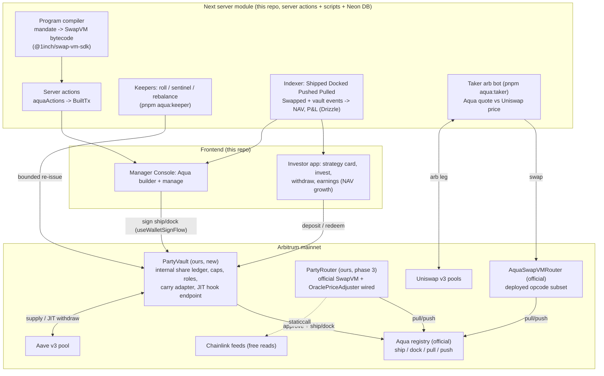
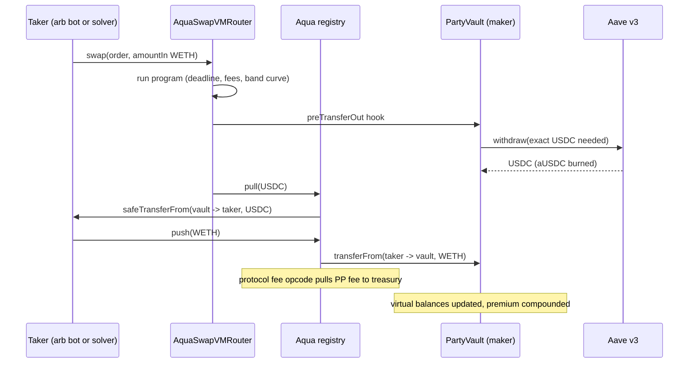

# Aqua Strategies: Architecture and Phased Implementation Plan

**Date:** 2026-07-25
**Status:** Approved direction (Murilo). Implementation not started. Linear epic: [POO-1057](https://linear.app/yeildbay/issue/POO-1057).
**Context:** 1inch Aqua/SwapVM hackathon. Target is a real production deployment on Arbitrum, not a demo toy.
**Method:** 8-agent research swarm over the `1inch/aqua`, `1inch/swap-vm`, `1inch/sdks` repos (both whitepapers read in full), plus a read-only sweep of the pool-party-frontend codebase. 9 candidate products were generated and adversarially judged against contract source. Raw research working files remain in the pool-party-frontend session scratch (`_tmp/aqua-hackathon/`, internal, not for this repo if public).

> **Addenda (Murilo, 2026-07-25, decided AFTER the body below was written; the addenda win on conflict):**
> 1. **No separate backend.** All orchestration (compiler, indexer/NAV, keepers, taker bot) is a server-only module of the Next app (server actions + `pnpm aqua:*` scripts), persisting to Postgres via Drizzle. The Next server side carries an **internal API module** (`src/lib/aqua/api/`) that plays pool-party-api's role: saves strategies to the DB and orchestrates on-chain calls; server actions are thin wrappers. The database is a **Neon mirror of prod** (created by Murilo) extended with `aqua_*` tables. See SRV rules in `01_BUSINESS_RULES.md`.
> 2. **Two homes (final).** THIS repo (`pool-party-aqua`, Murilo's personal account, private now, public by submission) holds the ON-CHAIN side: `contracts/` (Foundry: PartyVault, AaveV3Adapter, PartyRouter), deploy + fork-rehearsal scripts, and these canonical docs (VERIFIED/RUNBOOK/FILLS as they land). The FRONTEND stays in **pool-party-frontend on a fully separate branch** (`feat/aqua-poo-1057-hackathon`, never merged during the event), and that branch's Next server side hosts the internal API module, the Drizzle mirror schema, the server actions, and the keeper/bot scripts.
> 3. **Section 4.6 (frontend) applies as originally written** (pool-party-frontend, discriminator + `aquaStrategies` flag), on the separate branch; merge to main is post-hackathon.
> 4. **Review corrections (Rafael, 2026-07-25, approved):** canonical addresses are the GEN-2 pair in `VERIFIED.md` (READMEs document a dead gen-1); the live router runs the **v1.0.1-era array opcode table**, so read `swap-vm@v1.0.1` and never `main` (line references in this doc were written against `main`, treat as approximate); the `AquaProtocolFeeAmountIn` opcode is OUT of the v1 program (it charges tokenIn = WETH during runLoop and reverts against a WETH-at-0 ship); ship bytes are the ABI-encoded Order struct; every roll must change the salt.
> 5. **Timeline (D7): demo in 20 HOURS.** Compressed plan: P0+P1 first, P2 next, P3 (PartyRouter) conditional cut, UI minimal-first. See `02_WORKPLAN.md`.
**Scope of this doc:** the full on-chain architecture, custody model, fee model, backend and frontend integration, and a phased plan where every phase ships standalone real value.

---

## 1. Executive summary

We are adding a **new class of managed strategies** to Pool Party, powered by 1inch Aqua and SwapVM, alongside (not replacing) the existing Uniswap v3 class. Existing Pool Party smart contracts are not modified.

The first product of the class is **Active Reserve**: an Aave-cushioned "buy the dip" note. Roughly 90% of vault capital earns Aave v3 supply yield at all times; the remainder quotes an aggressive buy band below spot through a SwapVM program. The differentiator: even the parked capital is quotable liquidity, because a maker hook withdraws from Aave **inside the same transaction** as a fill. Capital earns interest until the exact second it buys the dip. This payoff is impossible to construct on Uniswap v3, where pooled liquidity earns nothing while it waits.

Why Aqua fits Pool Party structurally:

1. **Aqua's maker model is our manager model.** A maker runs strategies against funds that never leave their wallet until the instant of a fill. Our manager-runs-it / investors-get-exposure model maps 1:1 through one small vault contract.
2. **Strategies are data, not contracts.** A SwapVM strategy is bytecode composed off-chain. Our backend becomes the strategy compiler, rebalancer, and accountant. Re-parameterizing a strategy costs two accounting writes (cents), versus remove + swap + re-add on Uniswap v3 (gas, slippage, price impact).
3. **Fees become code.** A SwapVM opcode pulls the Pool Party protocol fee on-chain on every fill. Take-rate enforcement stops being backend bookkeeping.

Locked decisions (Murilo, 2026-07-25):

| Decision | Choice |
|---|---|
| Deployment target | **Production, Arbitrum mainnet** (no mocks, no fork-only demo) |
| Composed protocols | **Aave v3 + Uniswap v3** first; Compound and Morpho as stretch, via adapter |
| Custody | **Vault model** (pooled), one vault per strategy |
| Investor accounting | **Internal ledger, no ERC-20 share token** (OZ ERC-4626 math internally, transfers impossible by construction) |
| Risk containment | **Hard caps**: vault TVL cap, per-ship cap, router and token allowlists; guarded launch with our own capital |
| SwapVM router | **Start on the official deployed router; add our modified router (oracle opcode) as an upgrade**, off the critical path |
| Strategy management | Manager-driven with keeper automation per mandate policy |

---

## 2. Primer: how Aqua and SwapVM actually work

Everything in this section was verified against contract source by the research swarm. File references point into the upstream repos.

### 2.1 Aqua: a registry of virtual balances

Aqua's core (`src/Aqua.sol`, 81 lines) holds **no tokens, ever**. It is an accounting registry:

- The maker gives a normal ERC-20 `approve()` to the Aqua contract (outer exposure cap).
- `ship(app, strategyBytes, tokens[], amounts[])` opens a strategy: it writes **virtual balances** authorizing `app` to pull up to `amounts` of `tokens` for that `strategyHash = keccak256(strategyBytes)`. No tokens move. Strategy params are immutable after ship (`StrategiesMustBeImmutable`).
- On a fill, the app calls `pull()`: Aqua decrements the virtual balance and does `safeTransferFrom(maker, taker)` straight from the maker's wallet. The taker returns the input token via `push()`, which increments the virtual balance. **Earnings auto-compound into the strategy.**
- `dock(app, strategyHash, tokens[])` closes the strategy: zeroes balances, accounting only. Funds were never locked, so "withdrawing" is a no-op.
- If the maker's real wallet balance cannot cover a pull, the pull **reverts**. The strategy goes temporarily illiquid. There is no bad-debt path.
- Virtual balances may deliberately over-commit the wallet: the same funds can back many strategies and many apps simultaneously (the whitepaper's SLAC, shared liquidity amplification).

Security model: a malicious or buggy app can steal **at most the virtual balances shipped to it**, per strategy, per token. Ship amounts are the true blast radius. This makes per-ship caps a real risk control, not a cosmetic one.

Events for indexing: `Shipped`, `Docked`, `Pushed`, `Pulled`.

### 2.2 SwapVM: strategies as bytecode

SwapVM is an on-chain interpreter. A **program** is a byte string (`[opcode:1B][len:1B][args]` sequences) carried in an order, composed off-chain, never deployed. Takers call `swap()`/`quote()` on a deployed router; `quote()` runs the identical program statically, so pricing is simulated with a free `eth_call`.

**Aqua mode:** `MakerTraits.useAquaInsteadOfSignature` (default in the SDK) sources balances from `AQUA.safeBalances()` and settles via `AQUA.pull/push`. No EIP-712 signature exists or is needed: **shipping the encoded order into Aqua is the authorization.**

**Two traps the team must internalize** (both broke most of our machine-generated candidate designs; both were caught by source-level review):

1. **Curve instructions are terminal.** `concentrate`, `peggedSwap`, `xycSwap` end the program. The canonical composition order is `[deadline] [protocolFee] [flatFee] [adjusters] [curve] [salt]` (see upstream `test/base/AquaStrategyBuilders.sol`). Fee opcodes placed after the curve are silently never applied.
2. **Both tokens must always be shipped.** A one-sided strategy (e.g. a buy band holding only USDC) must still `ship` the other token with amount 0, or `safeBalances` reverts at quote and the taker's `push` reverts at fill (`Aqua.sol` L30-38, L72-79).

**Maker hooks are confirmed to fire in Aqua mode.** `SwapVM.sol` `_transferOut` (L309-321) runs the `preTransferOut` maker hook **before** the `AQUA.pull` branch. This is the load-bearing fact behind JIT lending withdrawal: the hook can pull exactly the needed amount out of Aave in the same transaction, before Aqua transfers it to the taker.

**Deployed opcode subset.** The official deployed `AquaSwapVMRouter` executes only the "aqua subset": jumps, deadline, taker-gating guards, `xycSwapXD`, `concentrateGrowLiquidity2D`, `peggedSwapGrowPriceRange2D`, `decayXD`, flat/protocol/Aqua-protocol fees, `extruction`, salt. **Limit orders, TWAP, Dutch auction, and invalidators are full-SwapVM-only and revert on today's deployments.** Our phase 1 product uses the deployed subset exclusively.

**Extension paths.** (a) New opcode = new router deployment: the dispatch chain is `internal virtual`; adding an instruction is a slot claim in `OpcodeList.sol`, one dispatch line, one router contract inheriting the official SwapVM. (b) `Extruction` (0x04) delegates to an external contract mid-program with no redeploy, at the implementer's own quote/swap-determinism risk.

**The unwired oracle instruction.** `src/instructions/OraclePriceAdjuster.sol` exists complete upstream (Chainlink `AggregatorV3` read, staleness check, `maxPriceDecay` loss cap) but has **no opcode slot and no tests**. Wiring it into our own router is ~15 lines of new Solidity and is our chosen "modified SwapVM" contribution (hackathon scoring axis), delivered as an upgrade in phase 3.

### 2.3 Official TypeScript SDKs

- `@1inch/aqua-sdk` (v0.2.x): `ship`/`dock` calldata builders (`CallInfo {to, data, value}`), `calculateStrategyHash`, typed event parsers (`.fromLog()`).
- `@1inch/swap-vm-sdk` (v0.3.x): `AquaProgramBuilder` composes programs as typed builder calls; `Order`/`MakerTraits` encoding (including the 4 pre/post transfer hook slots); `SwapVMContract.quote()` for `eth_call` pricing; concentrated-liquidity and pegged math calculators. The oracle-price-adjuster coder already exists in the SDK, so phase 3 needs no SDK fork.
- Best copy sources: `typescript/swap-vm/tests/swap-vm.spec.ts` (~1400 lines of e2e against an anvil mainnet fork), `typescript/aqua/tests/aqua.spec.ts`.

### 2.4 Addresses, audit status, license (read before deploying anything)

- **Address discrepancy to resolve on day 0:** the aqua repo README lists AquaRouter `0x499943e74fb0ce105688beee8ef2abec5d936d31`; the aqua-sdk constants list `0x1111113ccf1426a8e30e2bff5e005d929bf6a90a`; the SDK lists `AquaSwapVMRouter` at `0x1111113db0e0ef9d0e3a50d5f094a3a57a26c0de`; the swap-vm README lists `0x8fdd04dbf6111437b44bbca99c28882434e0958f` (bytecode confirmed present on Arbitrum and Base by our research). We must confirm the canonical Aqua + router deployments on Arbiscan (bytecode diff against source + evidence of real usage) before any `approve`.
- **Unaudited.** Both protocols are "Dev Preview"; no audit documents exist in either repo; reported coverage 61.54%. This is why caps and guarded launch are non-negotiable.
- **License is source-available, not OSS** (`LicenseRef-Degensoft-Aqua-Source-1.1` / `-SwapVM-1.1`, Degensoft Ltd). Free to use, deploy, and build apps against; copyleft applies to our modified router (we publish its source, which the hackathon requires anyway); commercial triggers apply at scale (charged fees > $100k/12mo or > $10M liquidity under control). Fine for the hackathon and guarded launch; requires a licensing conversation before large-scale go-live.

---

## 3. Product: Active Reserve, first of a class

**Investor pitch (jargon-free, per our UX philosophy):** "Your dollars earn interest until the exact second they buy the dip." Deposits earn Aave yield continuously. When the market dips into the manager's band, the note automatically buys at the manager's prices plus a fat fee ("dip premium"). Upside: Aave carry + premium + discounted entries. Honest framing: **cushioned, never "protected"**.

**Manager's alpha:** band placement (e.g. spot -15% to -5%), band width, fee level, roll cadence, and what to do with acquired inventory (hold / rebalance via Uniswap per mandate).

**Why it wins the hackathon:** single small new contract; deployed-subset opcodes only (phase 1 runs on 100% official deployments); the JIT hook is confirmed in source; and the demo money shot is one transaction trace showing an aUSDC burn (Aave withdrawal), Aqua `Pulled` (USDC vault to taker), and the WETH `push` back, i.e. real on-chain token transfers plus live lending composition in a single tx, on mainnet.

**Why it is a class, not a one-off:** the infrastructure below (vault + program compiler + keepers + indexer) is generic. Subsequent products reuse it with little or no new Solidity: live-range market making (Helm), covered-call range notes, stable-pair MM attached to the Savings epic (POO-966), grid strategies, multi-pair shared-liquidity desks. Each later product is mostly backend + frontend work.

---

## 4. Architecture

### 4.1 Layer map



### 4.2 Fill sequence (the money shot)



One transaction: Aave withdrawal, both real ERC-20 transfers, protocol fee capture, auto-compound.

### 4.3 On-chain: PartyVault specification (the one new contract)

Target: **~200 lines**, boring on purpose. One vault instance per strategy (per note).

**Investor accounting: internal ledger, no token.**
- `mapping(address => uint256) shares` + `totalShares`. No ERC-20 interface, no `Transfer` events, nothing appears in wallets. Transfers are impossible by construction (simplifies lockup, per-investor performance fee, and the regulatory surface; matches our current pattern where positions live in the contract and surface in the app).
- **Share math is OpenZeppelin ERC-4626 math used internally** (same conversion formulas, same rounding directions, decimals-offset anti-inflation defense). We do not reinvent vault math; we only drop the token interface.
- Public views mirror 4626 naming so auditors and power users feel at home: `sharesOf(address)`, `convertToShares(assets)`, `convertToAssets(shares)`, `totalAssets()`.
- Events: `Deposited(investor, assets, shares)`, `Redeemed(investor, assets, shares)`. Position proof = views + events on Arbiscan, linked from the strategy page.
- **Manager seeds first**: the manager's stake is the first deposit (kills the first-depositor vector in practice and keeps our visible skin-in-the-game metric).

**Roles (no admin backdoor to funds):**
- `MANAGER`: executes backend-built `ship`/`dock` calldata within caps; sets roll parameters through the same path; cannot move funds to any address (funds only ever move via Aqua settlement or investor redemption).
- `KEEPER` (backend key): `dock`/`ship` re-issues only, same caps, same allowlists. Compromise of this key cannot withdraw funds; worst case it re-parameterizes within caps (and the sentinel + manager can dock everything).
- No role can redeem another address's shares. There is no pause-and-take path. Emergency stop = `dockAll()` (callable by manager and keeper), which is accounting-only and makes the vault inert.

**Hard caps and allowlists (the unaudited-stack answer):**
- `maxTvl` (guarded launch: start low, e.g. $5k-20k of our own + manager capital; raise deliberately).
- `maxPerShip` per token (Aqua ship amounts are the literal blast radius).
- `routerAllowlist` (phase 1: official AquaSwapVMRouter only; phase 3: plus PartyRouter).
- `tokenAllowlist` (phase 1: USDC, WETH).

**Carry adapter seam (Aave now, Compound/Morpho later):**
```solidity
interface ICarryAdapter {
    function park(address token, uint256 amount) external;      // supply
    function unpark(address token, uint256 amount) external;    // exact withdraw
    function parkedBalance(address token) external view returns (uint256);
}
```
Phase 1 ships `AaveV3Adapter` (~50 lines over the Aave pool). Compound/Morpho become additional ~50-line adapters with zero vault-core changes. The vault keeps a small configurable hot buffer un-parked to keep small fills cheap.

**JIT hook endpoint:** `onPreTransferOut(token, amount)` restricted to the settlement context (allowlisted router), calls `adapter.unpark()` for the shortfall beyond the hot buffer. A `postTransferIn` sweep (or keeper cron) re-parks incoming tokens.

**Fees:**
- **Pool Party protocol fee: on-chain, per fill**, via the `AquaProtocolFeeAmountIn` opcode inside every program (pulled to the treasury address by Aqua during settlement). Not vault code; program code.
- **Manager performance fee: high-water-mark skim on share price**, minted as shares to the manager on `accrueFee()` (called on deposit/redeem/roll). Per-investor HWM is unnecessary because shares are non-transferable, so a global HWM is sound.
- Lockup: `lockupDays` per mandate enforced on `redeem` per deposit timestamp (matches the existing product field).

### 4.4 Program layer

The canonical Party Notes program (deployed subset only, phase 1):

```
[deadline(epoch end)]
[AquaProtocolFeeAmountIn(treasury, ~5 bps)]
[flatFeeAmountInXD(dip premium, 50-100 bps)]
[concentrateGrowLiquidity2D(bandLow, bandHigh)]   <- terminal curve
[salt(epoch id)]
```

Shipped balances: full USDC sleeve amount + **WETH at amount 0** (both-token registration rule). The band sits below spot, so the strategy only bids: it buys WETH during dumps; pushed WETH compounds into the strategy's virtual balance. Phase 3 inserts `[oraclePriceAdjuster(feed, maxStaleness, maxPriceDecay)]` between the fees and the curve, on our router.

Lifecycle: strategies are immutable, so every change (roll the band, change fee, new epoch) is `dock(old) + ship(new)` batched in one multicall through the vault. Cost: accounting writes, no token movement, no slippage.

### 4.5 Server module (owns most of the intelligence)

**Decision (Murilo, 2026-07-25): there is NO separate backend service.** All orchestration is a server-only module inside this Next app: pure logic in `src/lib/aqua/`, server actions in `src/features/*/operations/aqua*Actions.ts`, long-running processes as repo scripts (`pnpm aqua:keeper`, `pnpm aqua:taker`) executing the same module. State persists in the existing Neon Postgres via Drizzle (service-factory pattern, numeric-string money): tables `aqua_mandates`, `aqua_ships`, `aqua_fills`, `aqua_nav_snapshots`, `aqua_keeper_log`. Keeper/bot keys and RPC URLs are server-env only.

1. **Program compiler**: translates a manager mandate `{pair, bandLow, bandHigh, feeBps, epochLength, rollPolicy, capPerShip}` into program bytes via `AquaProgramBuilder`. Platform guardrails (protocol-fee opcode always present, deadline always present, band sanity vs oracle, cap checks) are injected here; the compiler is the only path to a ship, so a manager cannot produce an out-of-policy program.
2. **Server actions** (replacing what a backend would expose), same trust boundary as every existing flow: `aquaActions.ts` returns `BuiltTx` payloads validated by `builtTxSchema` and signed through the unchanged `useWalletSignFlow` handshake (build, review, sign) for deposit, redeem, ship, roll, dock.
3. **Keepers**:
   - *Roll keeper*: at epoch end (program deadline), builds the dock+ship roll; executes with the keeper role or queues for manager signature, per mandate policy.
   - *Sentinel*: watches Chainlink/Uniswap price vs band and vault coverage; docks strategies on mandate breach (e.g. deviation beyond bounds, adapter liquidity stress). In phase 1 this keeper is the oracle protection; in phase 3 the router enforces it on-chain too.
   - *Re-park keeper*: sweeps pushed tokens into the adapter; maintains the hot buffer target.
   - *Rebalance*: converts acquired WETH back per mandate via Uniswap v3 (our existing swap infra).
4. **Indexer**: consumes Aqua events (`Shipped/Docked/Pushed/Pulled`), router `Swapped`, and vault events with the SDK's typed parsers; live state from `rawBalances` + adapter views. Produces NAV, share price series, per-epoch P&L, and the yield attribution retail sees ("interest earned" vs "dip purchases" vs "premium").
5. **Taker arb bot** (ours): quotes our strategy via `eth_call quote()` and the same pair on Uniswap v3; when our quote beats Uniswap beyond gas, executes the arb atomically. This is real, profitable, self-funding flow that proves pricing liveness on mainnet, until organic 1inch solver routing exists.

### 4.6 Frontend (this repo)

Mapped against the current codebase by the research sweep:

- **Schema**: add `protocol: "uniswap-v3" | "aqua"` discriminator to `strategySchema` (absent = uniswap-v3 for back-compat). The schema already tolerates pair-less strategies; manager-side `inRange`/`range` become variant-specific.
- **Feature flag**: `aquaStrategies` in `src/lib/features/registry.ts` (`NEXT_PUBLIC_FEATURE_AQUA_STRATEGIES`, default off), read via `isFeatureEnabled` only.
- **Investor app**: strategy card + detail variant (no range card, no pool TVL tile, composition = vault sleeves; earnings = NAV growth; the attribution chart replaces claimable fees). Invest/Withdraw modals become vault deposit/redeem through the existing modal chrome and sign flow. **No Collect/Compound modals: compounding is automatic in Aqua.** Missing real data = hide, never fake (established rule).
- **Manager Console**: builder variant without the pool-node/range canvas (mandate: pair, band, fee, epoch, roll policy); manage view with live band, coverage, epoch countdown, and Roll/Dock actions.
- **Seams**: new `aquaActions.ts` server actions with `// PP-INTEGRATION-POINT` markers; standard IDs, i18n across all 11 locales, TDD for hooks/services/mappers, Storybook for new components.

Note: per Murilo's direction this workstream is wired against real Arbitrum from the start (no mock phase for the hackathon deliverable). Mock fixtures for the new schema fields are still added so the rest of the app keeps working in mock mode.

---

## 5. Custody and security model (team FAQ)

- **Who holds the money?** The PartyVault (and Aave via the adapter). Not the manager, not Pool Party, not Aqua (Aqua never holds tokens). Only the depositor's address can redeem its shares; no role can move funds to an arbitrary address.
- **Worst case if a strategy is bad or a router is buggy?** The shipped virtual balances of that strategy, at bad prices, bounded further by `maxPriceDecay` once the oracle opcode lands. Capital beyond shipped amounts (including the parked Aave sleeve above `maxPerShip`) is untouchable by settlement.
- **Worst case if the keeper key leaks?** Re-parameterization within caps and allowlists. No withdrawal path. Response: `dockAll()` + rotate key.
- **What if the vault can't cover a pull (Aave utilization spike, several fills at once)?** The pull reverts; the strategy is temporarily illiquid; no bad debt. The UI surfaces this state honestly.
- **What is NOT covered?** Contract risk in Aqua/SwapVM/our vault (all unaudited today): mitigated by caps and guarded launch, removed later by audit; Aave protocol risk; USDC risk. These go in the strategy risk disclosure.

---

## 6. Phased implementation plan

Every phase ends with something real on Arbitrum mainnet, demoable and valuable on its own. If the hackathon clock runs out mid-plan, we cut from the top, never ship half a phase. Phases 0-3 are the hackathon-critical path; 4 completes the product surface; 5 is expansion. Commit discipline: small PRs per component throughout (also a hackathon qualification requirement: no single-commit dumps).

### Phase 0: Verification spike (day 0-1) — kills all remaining unknowns

- Resolve the canonical Aqua + AquaSwapVMRouter addresses on Arbiscan (bytecode diff vs source, evidence of usage). Fallback if absent/ambiguous: deploy official unmodified source via the upstream Ignition modules (still "official contracts" per the rules).
- Fork rehearsal (anvil, ~2h): EOA approve + ship a minimal both-token concentrate program + swap + dock, copied from the SDK e2e specs. Proves address, program composition, and settlement end-to-end before any real money.
- Confirm `preTransferOut` hook firing with a stub maker contract on the fork.
- **Deliverable:** a `VERIFIED.md` note with addresses, tx hashes, and the go/no-go call.
- **Value:** every later phase builds on verified ground; zero rework risk from bad addresses or program shape.

### Phase 1: PartyVault + Aave adapter + first live strategy (days 1-3)

- Implement `PartyVault` (internal ledger, OZ 4626 math, roles, caps, allowlists, `AaveV3Adapter`, hook endpoint, HWM fee, `dockAll`). Foundry tests: share math (including inflation-attack property tests), role boundaries, cap enforcement, hook path.
- Backend: program compiler v1 + `aqua-ship/roll/dock` build endpoints; minimal ship script for the manager wallet.
- Deploy to Arbitrum with tight caps; manager (us) seeds; ship the first Party Notes band on the **official router**.
- **Deliverable:** a live, capped, self-custodial Aqua strategy on mainnet holding real (small) capital, earning Aave carry, quoting a dip band.
- **Value:** the product exists on-chain. Even alone, this is the first pooled-custody Aqua vault we know of.

### Phase 2: Taker arb bot + indexer + NAV (days 3-5)

- Arb bot: quote loop (our `quote()` vs Uniswap v3 pool), atomic execution, profit guard. Run it against our own strategy with small sizes.
- Indexer: Aqua/router/vault events into per-strategy P&L, share price series, and the 90/10 attribution.
- First real fills on mainnet: the single-tx trace (aUSDC burn + `Pulled` + `push`) is captured here and becomes the centerpiece of the final demo.
- **Deliverable:** real economic flow through the strategy + provable accounting.
- **Value:** demonstrable qualification requirement 2 (on-chain token transfers) on mainnet, not a fork; NAV numbers investors could actually be shown.

### Phase 3: PartyRouter, the modified SwapVM (days 5-7)

- Wire the upstream `OraclePriceAdjuster` instruction into a router inheriting official SwapVM (~15 lines of ours). Write the missing tests upstream never wrote: quote/swap parity, staleness behavior, `maxPriceDecay` clamping, both directions (property-based where possible).
- Deploy PartyRouter to Arbitrum, publish source (copyleft + hackathon requirement), add to the vault allowlist, migrate the strategy via dock+ship.
- Update programs to include the oracle guard; demo the guard rejecting an under-priced fill.
- **Deliverable:** our modified-SwapVM contribution live in production, with the strategy now carrying an on-chain bounded-loss guarantee.
- **Value:** the hackathon's highest-scoring axis, and a real investor-protection upgrade ("this strategy cannot trade more than X% through the market price").

### Phase 4: Product surfaces (days 7-10, parallelizable with 2-3)

- Frontend: schema discriminator + `aquaStrategies` flag + strategy card/detail variant + invest/withdraw against the vault + manager builder/manage variant + i18n (11 locales) + Storybook + tests, per section 4.6.
- Backend: deposit/redeem build endpoints hardened; sentinel + roll keepers in production mode.
- Guarded external launch decision point: raise `maxTvl` or keep it internal-only.
- **Deliverable:** the new class visible end-to-end in the app behind the flag; a manager can run it and an investor can join it.
- **Value:** the hackathon project becomes a Pool Party product, not a repo on the side.

### Phase 5: Expansion and hardening (post-hackathon)

- Compound/Morpho carry adapters (~50 lines each, vault untouched).
- Second product of the class (leading candidates from the judged set: Helm live-range MM, feasibility 5; Savings Plus stable MM attached to POO-966).
- Audit of PartyVault + PartyRouter; Degensoft licensing conversation; cap raises gated on both.
- Solver outreach (1inch routing to Aqua) to replace/augment our arb bot with organic flow.

### Effort summary

| Phase | Effort | Depends on | Standalone value |
|---|---|---|---|
| 0 Spike | 1 day | none | verified ground truth |
| 1 Vault + first strategy | 2-3 days | 0 | live capped strategy on mainnet |
| 2 Bot + indexer | 2 days | 1 | real flow + provable P&L |
| 3 PartyRouter | 2-3 days | 0 (parallel ok), migrate after 1 | on-chain price guard, scoring axis |
| 4 Product surfaces | 3-5 days | 1 (2-3 parallel) | investors + managers in the app |
| 5 Expansion | ongoing | 1-4 | new products, audit, scale |

---

## 7. Hackathon compliance mapping

| Requirement | How we satisfy it |
|---|---|
| Custom Aqua app implementing a sophisticated DeFi position | PartyVault as pooled maker + Active Reserve program (lending + market-making composition, JIT settlement) |
| SwapVM usage (scores higher) | The strategy IS a SwapVM program in Aqua mode; plus PartyRouter = modified SwapVM with a newly wired instruction |
| Official Aqua/SwapVM contracts used | Official Aqua registry + official AquaSwapVMRouter in phases 1-2; PartyRouter is the explicitly-allowed modified redeploy |
| On-chain execution of token transfers in the demo | Real fills on Arbitrum mainnet (phase 2 trace: aUSDC burn + Pulled + push in one tx). Stronger than the local-fork minimum |
| Proper git commit history | Phased PRs per component from day 0 |

---

## 8. Risk register

| # | Risk | Sev | Mitigation |
|---|---|---|---|
| 1 | Aqua/SwapVM unaudited (Dev Preview) | High | Hard caps, guarded launch with own capital, `dockAll`, audit before scale |
| 2 | PartyVault is new custody code | High | ~200 lines, OZ 4626 math, Foundry property tests, manager-seeds-first, audit in phase 5 |
| 3 | Address discrepancy (README vs SDK) | High (day 0) | Phase 0 Arbiscan verification before any approve |
| 4 | Program composition mistakes (terminal curves, both-token rule) | Med | Encoded in the compiler + fork rehearsal + this doc |
| 5 | Oracle adjuster has no upstream tests | Med | We write parity/staleness/clamp tests in phase 3; guard is additive, not load-bearing for phase 1 |
| 6 | No organic taker flow yet | Med | Our arb bot vs Uniswap = real, profitable flow; solver outreach in phase 5 |
| 7 | Aave utilization spike blocks JIT withdraw | Med | Hot buffer + pull-revert = illiquid-not-insolvent + honest UI state |
| 8 | Keeper key compromise | Med | Role limited to bounded re-issue; no withdrawal path; dockAll + rotation |
| 9 | Degensoft license at scale | Low now | Publish modified router source; licensing conversation before large TVL |
| 10 | "Cushioned" mis-sold as "protected" | Med | Copy review; risk disclosure; never "protected" anywhere |

---

## 9. Open items

1. Linear epic + numbered business rules (`[R1]...`, versioned) before implementation starts, per workflow. Sub-issues per phase.
2. Manager for the guarded launch = us (own capital). Confirm initial `maxTvl` and cap schedule.
3. Naming: "Active Reserve" is a working name; final product name pending.
4. Whether phase 4 external launch happens inside the hackathon window or right after (flag stays off until decided).
5. Chain expansion (Base, Polygon) after Arbitrum proves out; both have official deployments listed.

---

## References

- Aqua repo + whitepaper: `github.com/1inch/aqua` (`docs/whitepaper-aqua-1.0.pdf`)
- SwapVM repo + whitepaper: `github.com/1inch/swap-vm` (`docs/whitepaper-swap-vm-1.0.pdf`)
- TypeScript SDKs: `github.com/1inch/sdks` (`typescript/aqua`, `typescript/swap-vm`)
- Research working files (ephemeral): `_tmp/aqua-hackathon/` (aqua, swap-vm, SDK, and codebase-fit reports; 9 judged product candidates)
- Codebase seams referenced: `src/lib/schemas/index.ts`, `src/lib/features/registry.ts`, `src/features/strategies/hooks/useWalletSignFlow.ts`, `src/lib/tx/builtTxSchema.ts`, `src/lib/api/client.ts`
