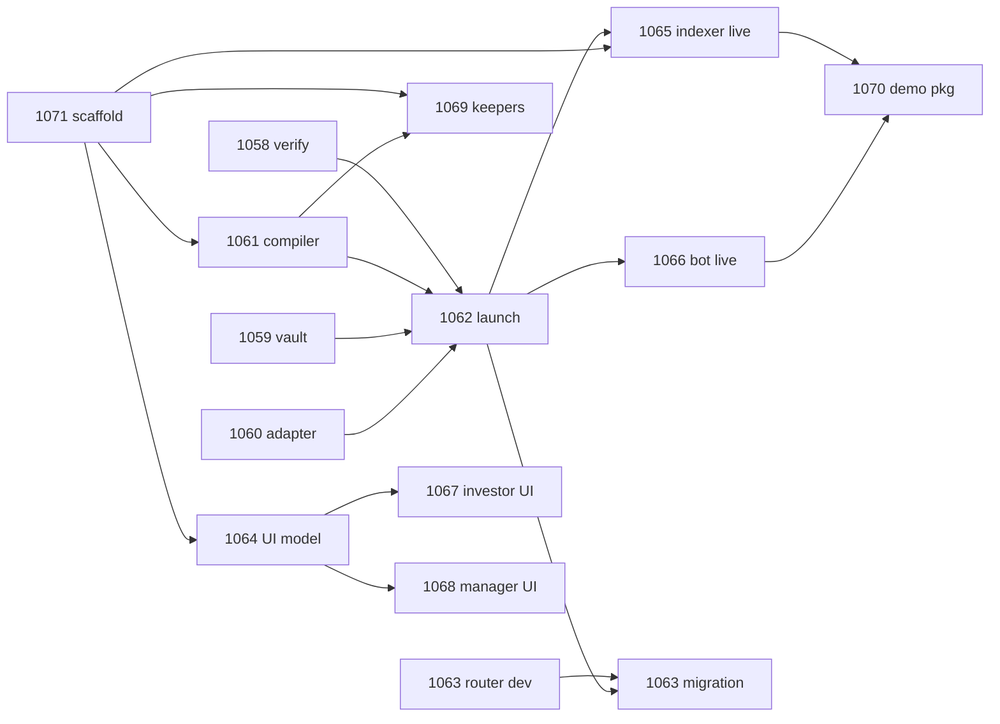

# Aqua Strategies: Workplan and Parallel-Session Coordination

**Date:** 2026-07-25
**Linear:** project "Aqua Strategies (1inch Hackathon)", epic [POO-1057](https://linear.app/yeildbay/issue/POO-1057). All issues are labeled `hackathon` and will probably be turned off/docked after the event.
**Read first:** `00_ARCHITECTURE_AND_PLAN.md` (architecture + addenda) and `01_BUSINESS_RULES.md` (numbered rules, single source of truth).

## Repo layout (target)

```
pool-party-aqua/
  contracts/            Foundry: PartyVault, AaveV3Adapter, PartyRouter, tests
  src/                  Next app (App Router)
    lib/aqua/           server-only module: config, compiler, indexer, nav, keeper-logic, bot-logic
    app/                demo UI routes (investor page, manager page)
    features/*/operations/  server actions (aquaActions, aquaManagerActions)
    db/                 Drizzle schema + migrations (aqua_* tables)
  scripts/              tsx entrypoints: rehearse, ship, roll, dock, status, aqua:keeper, aqua:taker
  docs/                 THIS folder: 00/01/02, VERIFIED.md, RUNBOOK.md, FILLS.md
```

## Issue map

| Issue | What | Phase | Hard blockers | Lane |
|---|---|---|---|---|
| [POO-1058](https://linear.app/yeildbay/issue/POO-1058) | Verify official deployments + fork rehearsal | P0 | none | A (chain truth) |
| [POO-1071](https://linear.app/yeildbay/issue/POO-1071) | Repo scaffold + server module + Drizzle schema | P1 | none (D1 details) | B (foundation) |
| [POO-1059](https://linear.app/yeildbay/issue/POO-1059) | PartyVault + Foundry tests | P1 | none (frozen interfaces) | C (contracts) |
| [POO-1060](https://linear.app/yeildbay/issue/POO-1060) | AaveV3Adapter + JIT hook + fork tests | P1 | none (frozen interfaces) | C (contracts) |
| [POO-1061](https://linear.app/yeildbay/issue/POO-1061) | Program compiler + ship/roll/dock | P1 | 1071 | B (server module) |
| [POO-1062](https://linear.app/yeildbay/issue/POO-1062) | Mainnet deploy + guarded launch | P1 | 1058, 1059, 1060, 1061, 1071 + D3/D4 | A |
| [POO-1066](https://linear.app/yeildbay/issue/POO-1066) | Taker MVP + arb bot vs Uniswap | P2 | 1062 (live), fork before | D (flow) |
| [POO-1065](https://linear.app/yeildbay/issue/POO-1065) | Indexer + NAV + attribution | P2 | 1062 (live), 1071; fork before | D (flow) |
| [POO-1069](https://linear.app/yeildbay/issue/POO-1069) | Keeper suite | P2 | 1061, 1071 | B |
| [POO-1063](https://linear.app/yeildbay/issue/POO-1063) | PartyRouter (oracle opcode) + migration | P3 | none for dev; 1062 for migration + D9 | C |
| [POO-1064](https://linear.app/yeildbay/issue/POO-1064) | Demo UI: typed model + app config (re-scoped) | P4 | 1071 + D6 | E (UI) |
| [POO-1067](https://linear.app/yeildbay/issue/POO-1067) | Demo UI: investor surface (re-scoped) | P4 | 1064 | E |
| [POO-1068](https://linear.app/yeildbay/issue/POO-1068) | Demo UI: manager surface (re-scoped) | P4 | 1064 | E |
| [POO-1070](https://linear.app/yeildbay/issue/POO-1070) | Demo runbook + submission package | P2+ | 1065, 1066 | A |

**Day-0 parallel start (no blockers): POO-1058, POO-1071, POO-1059, POO-1060, POO-1063 (dev part).** That is 5 sessions working simultaneously from minute one.

## Coordination protocol for parallel sessions/agents

1. **One session = one issue = one branch** (`<type>/aqua-poo-<num>-<slug>` off `main`). PR per issue, squash-merge. Never commit to `main` directly. Commit convention `<type>(aqua): <description>`; hackathon rule: honest incremental commits (history is judged).
2. **Frozen interfaces are law.** These may NOT change without a comment on the epic and Murilo's ack:
   - `ICarryAdapter { park, unpark, parkedBalance }` (defined in POO-1059 body)
   - Vault external surface: `deposit`, `redeem`, `sharesOf`, `convertToShares/Assets`, `totalAssets`, `execShip`, `execDock`, `dockAll`, `onPreTransferOut`, `sweep`, events `Deposited`/`Redeemed`
   - Mandate shape: `{ pair, bandLowPct, bandHighPct, feeBps, epochDays, bandSleevePct, maxPerShip }`
   - Canonical program order: `[deadline][AquaProtocolFeeAmountIn][flatFeeAmountInXD][(oraclePriceAdjuster when PartyRouter)][concentrateGrowLiquidity2D][salt]`
   - `compile(mandate)` return shape (POO-1061)
   - Drizzle table names `aqua_mandates`, `aqua_ships`, `aqua_fills`, `aqua_nav_snapshots`, `aqua_keeper_log`
3. **Addresses come from one place**: the shared config produced by POO-1058 (`VERIFIED.md` + `src/lib/aqua/config.ts`). Hardcoding an address anywhere else is a review-blocking defect.
4. **Rules drift**: if implementation reveals a rule is wrong or incomplete, STOP, comment on the issue + epic, wait for Murilo. Rule changes bump the version (v1 -> v2) in `01_BUSINESS_RULES.md`, the issue, and the `rules:vN` label. Never silently deviate.
5. **Docs updates land with the PR that makes them true** (VERIFIED/RUNBOOK/FILLS + rules re-sync). A PR that changes behavior without touching the affected doc is incomplete.
6. **Two upstream traps every session must know** (cost the judged ideas dearly): curve instructions are TERMINAL (fees after the curve never apply) and one-sided strategies must still ship BOTH tokens (empty side amount 0). Both are encoded as compiler guardrails (PRG-R1/R2); contract and UI sessions should still know why.
7. **Mainnet discipline**: nothing touches mainnet before POO-1058 is Done and D3/D4 are confirmed; only POO-1062 and later POO-1063 migration send mainnet txs from privileged keys; the bot uses its own wallet with its own small funds (BOT-R4).
8. **No em dash anywhere** (copy, comments, docs). English for all code/docs/Linear.

## Sequencing at a glance



## Definition of done (hackathon)

- Party Notes 90/10 live on Arbitrum mainnet under caps, with >= 3 real fills logged (at least one exercising the JIT Aave path).
- PartyRouter deployed + live strategy migrated (or consciously de-scoped with the sentinel documented as the price protection).
- Demo runbook reproducible cold by a teammate; submission checklist ticked; commit history phased.
- Every open decision D1-D10 resolved and recorded in `01_BUSINESS_RULES.md`.
