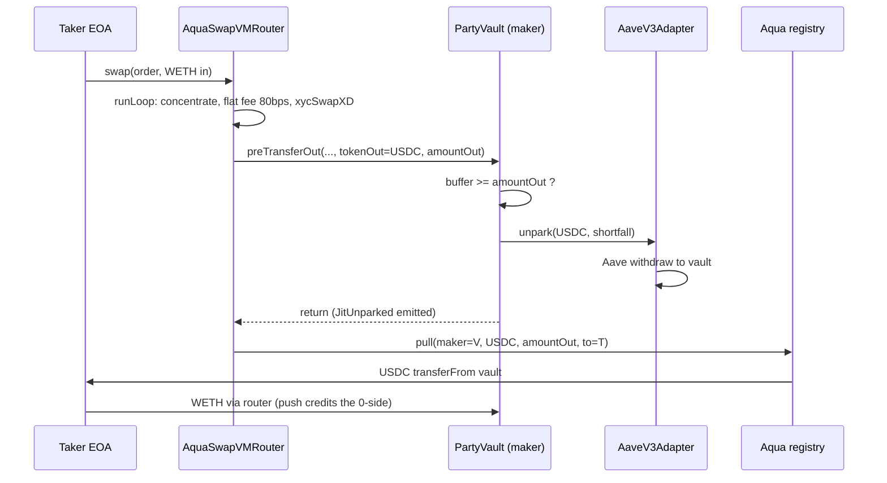

# What we built: Active Reserve

Live on Arbitrum One. Every claim on this page is backed by a file path, a contract address or a
transaction hash. Ground truth: [../VERIFIED.md](../VERIFIED.md). Settlement ledger:
[../FILLS.md](../FILLS.md).

---

## 1. The product

Active Reserve is a managed on-chain strategy where the manager's capital is never idle and never
in two places at once. Investor USDC sits in a vault ([`contracts/src/PartyVault.sol`](../../contracts/src/PartyVault.sol));
roughly 95 percent of it is supplied to Aave v3 through a minimal adapter
([`contracts/src/AaveV3Adapter.sol`](../../contracts/src/AaveV3Adapter.sol)) and earns lending
interest every block. The remaining hot buffer is what the vault actually holds in its wallet. At the
same time, the vault ships a SwapVM program to the official 1inch Aqua registry that quotes a buy
band strictly below spot: a standing bid to buy ETH at a discount. Aqua quotes that band off the
virtual balances registered at ship time, not off the vault's wallet balance, so the full sleeve is
quotable while the money is still earning. When a taker actually fills, the router calls the vault's
`preTransferOut` hook immediately before it moves any funds, and the vault withdraws from Aave
exactly the shortfall it needs, inside the same transaction. Yield stops accruing on that capital in
the block it becomes ETH, not before.

The official product description, verbatim (rule FE-R10, [../01_BUSINESS_RULES.md](../01_BUSINESS_RULES.md)):

> An always-earning reserve that buys the dip. Capital earns Aave lending yield every block and is
> deployed automatically the instant the market dips into the manager's buy band, purchasing ETH
> below market price. Objective: accumulate ETH at a discount while never sitting idle.

---

## 2. The mechanism, step by step

**Step 1: seed and park.** The manager deposits USDC. `deposit()` mints internal, non-transferable
shares using ERC-4626 conversion math with a +3 decimals offset (VLT-R1, VLT-R2). The manager then
calls `parkUsdc()`, which supplies the sleeve to Aave v3 through the adapter. On mainnet: 10 USDC
seeded (tx [`0x0cfc605e`](https://arbiscan.io/tx/0x0cfc605e070923cbe816b1656d76fd2889cc209de21105742ee45e380d22bbf3)),
9.5 parked to Aave (tx [`0x05383f15`](https://arbiscan.io/tx/0x05383f15007141f67a8c7c8528390e8fb3f9b0e3ffc80e89e4b9d25dfc2c4787)),
0.5 left as hot buffer.

**Step 2: compile a band into a program.** [`scripts/build-orders.ts`](../../scripts/build-orders.ts)
reads the Chainlink ETH/USD answer and emits a SwapVM program in the measured canonical order
(PRG-R1 v3):

```
[deadline][concentrateGrowLiquidity2D][flatFeeAmountInXD 80bps][xycSwapXD][salt]
```

`concentrateGrowLiquidity2D` shapes the reserves into the band; `xycSwapXD` is the instruction that
actually executes the constant-product swap on those shaped reserves. The 80 bps flat fee sits
between them. That order is not a guess: all four pre-existing live gen-2 programs were decoded and
round-tripped through our builder to byte-identical bytes, and a fee placed after the executing
curve was measured to make the strategy unquotable rather than silently free (trap C,
[../VERIFIED.md](../VERIFIED.md)). The program is wrapped in an Order struct whose `MakerTraits`
carry a `preTransferOutHook` on a zero-address `Interaction`, which is how the router is told to call
the maker itself.

**Step 3: ship.** `execShip()` calls `Aqua.ship(router, orderBytes, tokens, amounts)`. This moves
zero tokens (trap B). It registers virtual balances: USDC at the shipped size, WETH at 0. Two bands
went live:

| Band | strategyHash | Shipped | Range at build time |
|---|---|---|---|
| DEMO (spot -0.3% to -0.1%) | [`0x77097fd3...`](https://arbiscan.io/tx/0x988f774a1284fd6fbcf6e7c6afde30b9b6550da04d8edbe060f40c522b130ba9) | 0.6 USDC | 1867.56 to 1871.30 USD |
| PRODUCTION (spot -15% to -5%) | [`0xafbd59da...`](https://arbiscan.io/tx/0xdbebc9caa1ddd2f2164db6f435605e1512fc3bc293328680f7079971e8ed094d) | 0.4 USDC | 1592.20 to 1779.52 USD |

The production band is the mandate default. The demo band is deliberately tight so the market could
plausibly reach it inside a 20-hour window; the offsets are literal in
[`scripts/build-orders.ts`](../../scripts/build-orders.ts) line 78, and it is labelled DEMO
everywhere it appears.

**Step 4: the vault's `totalAssets` does not change.** Shipping registered liquidity that the vault
does not hold in its wallet. The smoke test after both ships read `totalAssets` 10.000002 USDC
(RUNBOOK section 10): the seed, plus the Aave carry that had already started. That is the entire
point of the model.

**Step 5: a taker fills.** The taker quotes the strategy through the official AquaSwapVMRouter and
sends a swap. Inside `SwapVM._transferOut`, immediately before `AQUA.pull` moves anything, the router
calls the maker hook. The measured signature is nine arguments, selector `0x5a394f80`
([../VERIFIED.md](../VERIFIED.md)); the vault implements it at
[`PartyVault.sol:355`](../../contracts/src/PartyVault.sol) with two guards: only the canonical router
may call it, and the order's maker must be this vault.

**Step 6: just-in-time unpark.** The hook compares `amountOut` against the wallet balance of
`tokenOut`. If the buffer covers it, the hook returns and does nothing. If it does not, the vault
calls `ADAPTER.unpark(tokenOut, shortfall)` for exactly the shortfall, emits `JitUnparked`, and
returns. Then `AQUA.pull` executes, and the swap settles.



**Step 7: the single transaction.** Fill 1, the money shot:
[`0xbc64ec2d`](https://arbiscan.io/tx/0xbc64ec2db39c6a8f718487268e4195c63e472f0ad0ae1f46e09919a1a9c5bb83),
Arbitrum block 487666888, 336,000 gas. 0.0003 WETH went in, 0.556382 USDC came out, an implied
1854.61 USD per ETH. Read the numbers in this order:

| Quantity | Value (raw USDC units) |
|---|---|
| Owed to the taker | 556,382 |
| Vault wallet balance at the time | 500,000 |
| Shortfall withdrawn from Aave inside the fill | 56,382 |
| aUSDC burned on the adapter | 56,379 |

The vault withdrew the shortfall and not one unit more. The 3-unit gap between the aToken burn and
the USDC received is Aave scaled-balance rounding, not a discrepancy. Until that transaction
executed, every one of those 56,382 units was earning Aave interest. The full decoded log list is in
[../FILLS.md](../FILLS.md).

Three fills landed on mainnet, and all three hit the JIT path (the second and third because the
buffer was already spent). Fill 3 ran against the PRODUCTION band, proving the second strategy
settles too.

---

## 3. Why this is not possible on a normal AMM

On a constant-product AMM, liquidity is custody. To quote a price you must have deposited the tokens
into the pool contract, and while they sit there waiting for a taker they earn nothing. That is the
structural cost of a resting bid: you pay for optionality with idle capital. Workarounds exist and
all of them are worse. Yield-bearing wrappers as pool assets move the idleness one layer down and
add a depeg surface. A keeper that watches the price and deposits into the pool when the market
approaches your level is racing the block that fills you, and loses that race exactly when the move
is fast, which is the only time the band matters. Splitting funds between a lending market and a
pool means the quoted depth is only the part that is not earning.

Aqua removes the tradeoff because quoting and settling are separated:

1. **Quoting reads virtual balances.** `ship()` writes an accounting entry in the Aqua registry
   (token list plus amounts) and moves zero tokens. We measured this: trap B in
   [../VERIFIED.md](../VERIFIED.md), and the vault's `totalAssets` was unchanged across both ships.
2. **`safeBalances` never reads the maker's wallet balance.** This is the load-bearing fact. It is
   why a vault holding a 0.5 USDC hot buffer can honestly quote a 1.0 USDC band across two
   strategies, with the rest of the capital sitting in Aave.
3. **Only `pull` needs real tokens**, and `pull` is the last step of the settlement transaction,
   after the maker hook has already run. `Aqua.pull` executes `safeTransferFrom(maker, to, amount)`,
   so the maker approves the registry and keeps custody until that instant.
4. **The maker hook fires strictly before the pull**, carrying the settled `amountOut`. Exact-amount
   JIT sourcing is therefore possible, not approximate pre-funding.

Put together: the capital is in Aave right up to the moment of settlement, and the settlement
transaction itself is what takes it out. There is no window in which the vault is holding idle USDC
"just in case", and no keeper race, because the unpark is not a reaction to the fill, it is part of
the fill.

The failure mode is also right. When the demo band ran out of depth, the next fill reverted with an
arithmetic underflow inside `pull` rather than over-committing. Aqua refuses to settle against
liquidity the maker cannot deliver; there is no bad-debt path.

---

## 4. Why Aqua fits a managed-strategy platform structurally

Pool Party is an on-chain asset management system: managers build strategies, retail investors
access them. Three properties of Aqua map onto that shape better than a pool-based venue does.

**Maker self-custody maps onto manager-runs-it.** In Aqua the maker is an address that keeps its own
tokens and approves the registry. That is exactly the custody boundary a managed product needs: the
vault holds investor funds, the manager decides what it quotes, and no strategy action can send
funds to an arbitrary address. The vault has three and only three exits: `redeem` to the share
holder, Aqua settlement against a strategy the owner shipped, and the carry adapter. No
upgradability, no pause-and-take, an immutable owner. That is enforced by construction in
[`PartyVault.sol`](../../contracts/src/PartyVault.sol), not by policy.

**Strategies are data, so re-parameterizing is cheap.** Changing a Uniswap v3 range means burning a
position, swapping to rebalance, and minting a new one: real gas, real slippage, real MEV surface,
every single roll. In Aqua a roll is `dock(old)` plus `ship(new)`, two accounting writes, no token
movement. Moving a band is therefore a management decision rather than a trading cost, which is what
makes an actively managed band viable at small size. The one constraint we measured and had to
respect: a docked strategyHash is dead forever (the registry writes a sentinel), so every roll must
change the program salt. The compiler enforces it (PRG-R10).

**Fees can be enforced in the program.** The 80 bps maker premium is an instruction inside the
program (`flatFeeAmountInXD`), not an off-chain agreement or a post-hoc sweep. A taker cannot fill
around it. For a platform that has to charge and account for strategy economics across many
managers, having the fee live in the quoted curve itself is a materially better place for it. We
also measured the limits here honestly: the on-chain protocol fee opcode charges `tokenIn`, which is
WETH on a buy band shipped at amount 0, so it reverts; and no `tokenOut` variant exists in the Aqua
instruction set at all (traps E and F). That fee stays out of v1 and the reason is written down, not
smoothed over.

---

## 5. Who does what

| Actor | Address | Can | Cannot |
|---|---|---|---|
| Manager (owner) | [`0xc365B679...`](https://arbiscan.io/address/0xc365B6795443380eb76516dA0Cedd5a00B349d66) | deploy, seed, `parkUsdc` / `unparkUsdc`, `execShip`, `execDock`, `dockAll`, `setMaxTvl`, `revokeAquaApproval` | move funds to an arbitrary address, redeem another holder's shares, upgrade, pause and take |
| Investor | any address, once seeded | `deposit` USDC, `redeem` shares for USDC | transfer shares (no ERC-20 interface exists), redeem in kind, deposit past `maxTvl`, deposit before the manager seed |
| Taker | [`0x67Fd51e5...`](https://arbiscan.io/address/0x67Fd51e5082205AF0bD97039a6124Ff3368aD0da) | quote and fill the bands like any other taker | anything privileged on the vault; it has no role at all |
| Router (canonical AquaSwapVMRouter) | `0x1111113Db0e0ef9D0E3A50d5f094a3a57a26C0DE` | call `preTransferOut` on the vault during settlement | anything else; the hook rejects every other caller with `NotRouter` |

Two guards are worth spelling out because they are the difference between a hook and a hole. The
vault's `preTransferOut` reverts `NotRouter` if the caller is not the canonical router, and
`NotOurOrder` if the order's maker is not the vault itself. Without the second one, a third party
could point a hook at us and force our sleeve out of Aave at will. The hook also ignores
`takerHookData` entirely, because it is taker controlled.

The taker is a deliberately separate wallet holding only its own working capital (BOT-R4). It is not
the manager and has no privileged access.

---

## 6. What is real today versus what is designed

**Real, on Arbitrum mainnet, verifiable right now:**

| Fact | Evidence |
|---|---|
| PartyVault and AaveV3Adapter deployed and source-verified | [`0xec870a6A...`](https://arbiscan.io/address/0xec870a6A9E8EE41B349FD0766b8f295D6EDC6610), [`0x6d409fF8...`](https://arbiscan.io/address/0x6d409fF8578D017AddDB2e9Ad0848D8F0A65aBAe) |
| Two bands shipped to the official Aqua registry | ship txs in the step-3 table above |
| Three fills settled through the official router, all on the JIT path | [../FILLS.md](../FILLS.md) |
| Aave withdrawal and both swap legs inside one transaction | [`0xbc64ec2d`](https://arbiscan.io/tx/0xbc64ec2db39c6a8f718487268e4195c63e472f0ad0ae1f46e09919a1a9c5bb83) |
| NAV reconstructed off chain matched the vault's own `totalAssets()` | diff 0, `pnpm status` |
| ETH accumulated below spot | 0.00034 WETH at an average 1848.75 USD, 1.36 percent below spot; dip leg +0.008636 USDC |
| Aave carry accruing every block | NAV 10.008642 USDC after the fills, up from the 10.0 seed |
| 62 Foundry tests green, including two Arbitrum fork suites | `cd contracts && forge test` |

**Designed and specified, consciously cut from the window.** Each of these has a numbered rule in
[../01_BUSINESS_RULES.md](../01_BUSINESS_RULES.md) and is listed with its in-window substitute in
[./06_ROADMAP.md](./06_ROADMAP.md): PartyRouter with the OraclePriceAdjuster instruction wired (the
modified-SwapVM axis), the keeper loop, the manager UI, the in-vault Chainlink staleness gate, the
redemption lockup, a separate KEEPER role, the high-water-mark performance fee, `maxPerShip` and
token allowlists, and main-app integration behind the `aquaStrategies` flag. None of these is a gap
we failed to notice; the vault that shipped is the demo minimum, and its own NatSpec says so.

**The close-out, stated plainly.** After the demo the inventory was sold back, `EmergencyStop` docked
both strategies and revoked both Aqua allowances, `maxTvl` was set to 0, and 9.956441 USDC was
redeemed to the manager. Roughly 0.0000285 WETH (about 5 US cents) remains in the vault as residual
inventory. One operational finding came out of that sequence and is worth reading if you are building
on Aqua: `_ensureAquaAllowance` only tops up for what a ship commits, and a buy band ships WETH at
amount 0, so the vault never grants Aqua a WETH allowance. Selling inventory back therefore needs an
explicit owner approval, and it must happen before the emergency stop revokes everything. That
ordering is now in [../../RUNBOOK.md](../../RUNBOOK.md) section 7b.

---

## 7. What the evidence does and does not show

The three buy-side fills are **self-directed settlement proofs**. Our own taker wallet bought from our own
strategy. They are not arbitrage profit and they are not organic demand, and we would rather say so
than let a judge discover it.

The reason is structural, not circumstantial: a band that bids below spot cannot win arbitrage by
construction. It only becomes the best bid when the market actually falls into it, and at that point
arbitrageurs fill it for their own reasons. Manufacturing organic demand inside a 20-hour window
would have required the market to move, which is not something we control.

What the fills do prove is the part that was uncertain: that a pooled-custody contract can be an Aqua
maker, that a program in the measured canonical order quotes and settles on the deployed router, and
that capital parked in a lending market can back a live quote and be withdrawn inside the settling
transaction. That mechanism is the product. It is decoded, block by block, in
[../FILLS.md](../FILLS.md).

The one number in this document that is external and real regardless of who filled is the Aave
carry. It accrues every block whether anyone trades or not, and it is why the NAV after the demo was
above the seed.

---

**Next:** [02_ARCHITECTURE.md](./02_ARCHITECTURE.md) for the as-built contract and flow detail,
[../VERIFIED.md](../VERIFIED.md) for the measured ground truth,
[../05_DEMO_WALKTHROUGH.md](../05_DEMO_WALKTHROUGH.md) to reproduce all of it yourself.

## Why the fill price sits below the quoted band

Fill 1 settled at an implied 1854.61 USD per ETH while the demo band reads 1867.56 to 1871.30.
Both numbers are correct: the band is the curve, and the program also charges an 80 bps maker
premium (`flatFeeAmountInXD`) before the curve executes. The taker therefore pays band price
minus the fee we charge, which is exactly the spread the strategy earns. Fill 3 shows the same
relationship on the production band.
