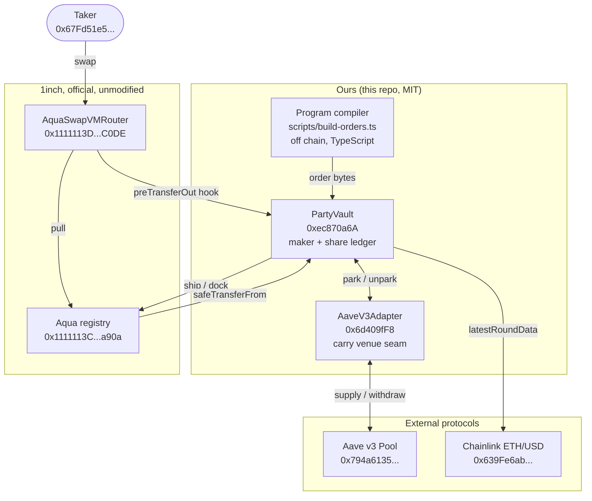
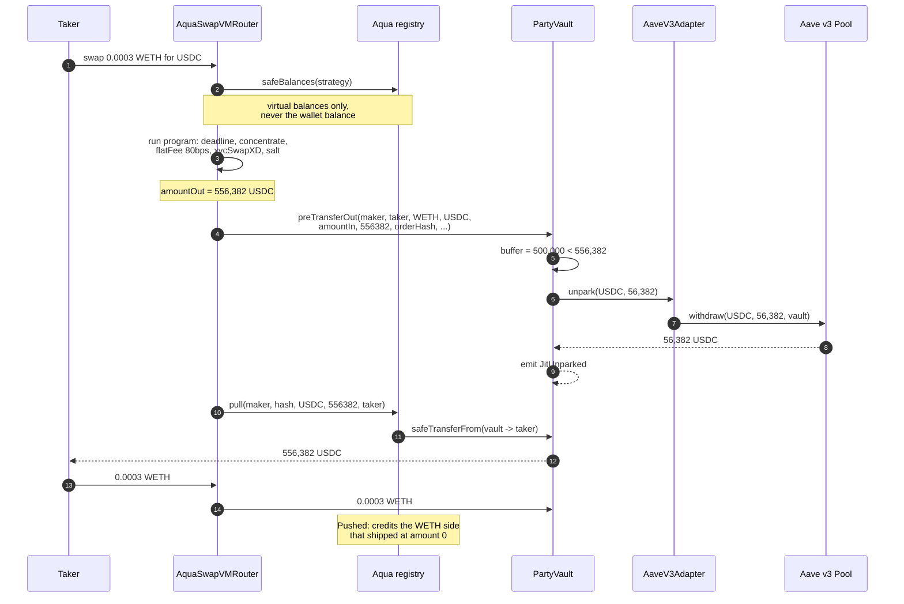
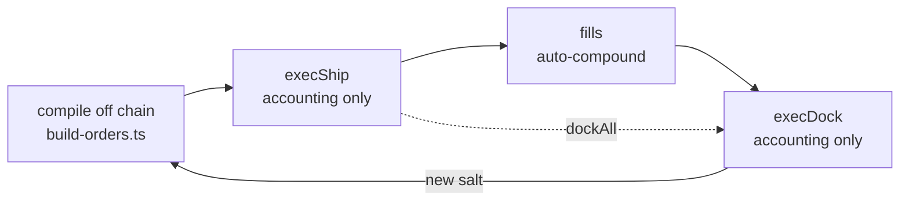

# 02. Architecture, as built

What is actually deployed on Arbitrum One, function by function. Everything here is either in the
repository or on chain, and every claim points at a file, an address or a transaction hash.

Two contracts of ours, 635 lines of Solidity between them, both verified on Arbiscan:

| Contract | Address | Source | Lines |
|---|---|---|---|
| `PartyVault` | [`0xec870a6A9E8EE41B349FD0766b8f295D6EDC6610`](https://arbiscan.io/address/0xec870a6A9E8EE41B349FD0766b8f295D6EDC6610#code) | [`contracts/src/PartyVault.sol`](../../contracts/src/PartyVault.sol) | 521 |
| `AaveV3Adapter` | [`0x6d409fF8578D017AddDB2e9Ad0848D8F0A65aBAe`](https://arbiscan.io/address/0x6d409fF8578D017AddDB2e9Ad0848D8F0A65aBAe#code) | [`contracts/src/AaveV3Adapter.sol`](../../contracts/src/AaveV3Adapter.sol) | 114 |

Plus 185 lines of interface declarations and a 36-line `AddressBook`. No proxies, no upgrade path,
no vendored upstream source.

---

## 1. Layer map

Three layers. We wrote the middle one. The outer two are official contracts we call unmodified.



The seam that matters: the router calls **our** contract mid-settlement (`preTransferOut`), and our
contract calls **Aave** from inside that call. Nothing else in the diagram is unusual.

Address provenance and version pinning for every external box live in
[`03_INTEGRATIONS.md`](./03_INTEGRATIONS.md) and [`../VERIFIED.md`](../VERIFIED.md). All addresses
are declared once, in [`contracts/src/AddressBook.sol`](../../contracts/src/AddressBook.sol); a
hardcoded address anywhere else in the repo is a review-blocking defect.

---

## 2. Contract reference

### 2.1 PartyVault (521 lines)

Pooled-custody Aqua maker. It holds investor USDC, keeps the idle sleeve earning in Aave, quotes a
buy band on Aqua, and withdraws from Aave inside the settlement transaction when a fill lands.

Rule IDs below are from [`../01_BUSINESS_RULES.md`](../01_BUSINESS_RULES.md) (prefix `VLT`).

**Constructor immutables.** All seven are set once and can never change. There is no owner transfer,
no renounce, no setter for any of them. Key rotation means a new deployment.

| Immutable | Live value | Why immutable |
|---|---|---|
| `USDC` | `0xaf88d065...5831` (native, not USDC.e) | deposit and redemption asset |
| `WETH` | `0x82aF4944...Bab1` | the second token every band registers |
| `AQUA` | `0x1111113CCf1426A8E30e2bfF5E005d929bF6a90a` | the registry that pulls from us |
| `ROUTER` | `0x1111113Db0e0ef9D0E3A50d5f094a3a57a26C0DE` | forced as the Aqua app on every ship, and the only address allowed to call the hook |
| `ADAPTER` | `0x6d409fF8...aBAe` | carry venue |
| `PRICE_FEED` | `0x639Fe6ab...ba612` | Chainlink ETH/USD, 8 decimals |
| `OWNER` | `0xc365B679...9d66` | the manager |

Two derived immutables: `shareDecimals` (asset decimals plus 3, so 9 for USDC) and a precomputed
`10 ** (feedDecimals + wethDecimals - usdcDecimals)` scale used to value the WETH leg.

**External surface.** Every function, what guards it, and which rule it implements.

| Function | Access | Guards it enforces | Rule |
|---|---|---|---|
| `deposit(assets)` | anyone once seeded | `nonReentrant`; `ZeroAmount`; first depositor must be `OWNER` else `NotSeeded`; `MaxTvlExceeded` against post-deposit `totalAssets`; `ZeroShares` refuses a deposit that would mint nothing | VLT-R1, R2, R10 |
| `redeem(shares)` | share holder | `nonReentrant`; `InsufficientShares`; `ZeroAssets`; unparks the shortfall from Aave, and reverts `InsufficientLiquidUsdc(requested, available)` rather than paying partially or in kind | VLT-R5 |
| `preTransferOut(...)` | `ROUTER` only | `NotRouter` on any other caller; `NotOurOrder` unless `maker == address(this)`; `makerData` and `takerData` are ignored entirely | VLT-R9 |
| `execShip(order, tokens, amounts)` | `OWNER` | `InvalidShipArrays`; the Aqua app is hardcoded to `ROUTER`, not a parameter; `StrategyAlreadyActive`; tops up the registry allowance only for tokens shipped non-zero | VLT-R7 (reduced) |
| `execDock(hash)` | `OWNER` | `StrategyNotActive`; replays the stored token list, which Aqua requires in full | VLT-R7 |
| `dockAll()` | `OWNER` | accounting only, so it cannot fail for lack of liquidity | VLT-R11 |
| `parkUsdc(amount)` / `unparkUsdc(amount)` | `OWNER` | `ZeroAmount`; `park` approves the adapter for exactly `amount`, consumed by the call | ADP-R1 |
| `setMaxTvl(cap)` | `OWNER` | none beyond ownership | VLT-R10 |
| `revokeAquaApproval(token, amount)` | `OWNER` | general allowance setter despite the name: zero revokes, any other value grants | VLT-R11 |
| `totalAssets()` | view | reverts `InvalidPrice` on a non-positive Chainlink answer | VLT-R4 |
| `sharesOf`, `convertToShares`, `convertToAssets`, `liquidUsdc`, `activeStrategies`, `strategyTokens`, `isStrategyActive` | view | none | VLT-R3 |

`totalAssets()` is USDC buffer plus `ADAPTER.parkedBalance(USDC)` plus WETH valued at the Chainlink
answer. The parked leg is the raw aToken balance, so Aave carry lands in NAV every block without any
accrual call.

The one guard that is **not** in the shipped code: the in-vault Chainlink staleness gate specified
by VLT-R4. It was cut with the rest of the window scope (section 6). `pnpm status` reads the
feed off chain instead, and a non-positive answer still reverts.

### 2.2 AaveV3Adapter (114 lines)

Deliberately tiny and final. Three functions, no admin, no owner, no rescue, no upgrade path
(ADP-R5). Replacing the venue means deploying a new vault against a new adapter, which is why the
seam is frozen.

It implements [`ICarryAdapter`](../../contracts/src/interfaces/ICarryAdapter.sol), a three-function
interface marked FROZEN in source: the vault, this adapter and the TypeScript rails were all built
against it in parallel, and Compound or Morpho become sibling adapters with zero vault-core changes.

| Function | Behaviour | Rule |
|---|---|---|
| `park(token, amount)` | `onlyVault`; `UnsupportedToken` on anything but `UNDERLYING`; pulls the approved underlying with `transferFrom(VAULT, ...)`, approves the Pool, supplies. Ends the call holding aTokens and zero underlying | ADP-R1, R4 |
| `unpark(token, amount)` | `onlyVault`; calls `POOL.withdraw(token, amount, VAULT)` straight to the vault; `UnparkAmountMismatch` if Aave returns anything other than the exact request; bubbles Aave's revert when the reserve cannot serve it | ADP-R2 |
| `parkedBalance(token)` | raw aToken balance, interest inclusive, rebasing every block; answers 0 for any other token so vault views stay total | ADP-R3 |

**The aToken self-check.** The constructor calls the aToken's own getters and reverts
`ATokenMismatch` unless `UNDERLYING_ASSET_ADDRESS() == underlying` and `POOL() == address(pool)`.
A mis-wired aToken cannot reach mainnet. The same pair is asserted again in the deploy script.

**Exact-amount withdraw, not max.** `unpark` never passes `type(uint256).max` and never sweeps.
Withdrawing exactly the shortfall is what keeps the rest of the sleeve earning through the fill, and
the `UnparkAmountMismatch` check means a venue that silently short-fills reverts the whole
settlement rather than leaving the vault owing tokens it does not have.

**Deployment ordering.** The adapter and the vault reference each other immutably, which is a
chicken-and-egg problem. [`Deploy.s.sol`](../../contracts/script/Deploy.s.sol) predicts the vault
address with `vm.computeCreateAddress(deployer, nonce + 1)`, constructs the adapter with it, then
asserts the round trip (`adapter.VAULT() == address(vault)` and `vault.ADAPTER() == adapter`) plus
owner, router and registry. Those assertions run during simulation, before anything is broadcast, so
a wrong prediction aborts the run instead of publishing a mis-wired pair. The script also refuses
any chain that is not Arbitrum One and any `maxTvl` above a hardcoded 1000 USDC window cap.

---

## 3. The share ledger

`PartyVault` is an ERC-4626 vault in every way except the one that matters legally: **there is no
share token.**

**The math is OpenZeppelin's.** Both conversions are OZ `ERC4626` verbatim, with virtual shares and
virtual assets and floor rounding:

```solidity
_convertToShares: Math.mulDiv(assets, totalShares + 10**3, assetsBefore + 1, Floor)
_convertToAssets: Math.mulDiv(shares, assetsNow + 1, totalShares + 10**3, Floor)
```

`DECIMALS_OFFSET = 3` is the same anti-inflation defence as OZ's `_decimalsOffset()`: shares carry
three more decimals than the asset (9 for USDC), so a first-depositor donation cannot round a later
depositor down to zero shares. Deposits price against `totalAssets` measured **before** the incoming
transfer, matching ERC-4626 exactly.

**The ledger is a mapping, not a token.** `mapping(address => uint256) private _sharesOf`, exposed
through `sharesOf()`. No `transfer`, no `approve`, no `Transfer` events, no ERC-20 interface at all.
`test_noErc20ShareSurface` pins that the surface is absent rather than merely unused.

Why non-transferable is a feature and not a shortcut:

- **Lockup becomes trivial.** With no secondary transfers, a per-investor lockup is a timestamp
  check on redeem. With a transferable token it needs transfer hooks and cost-basis tracking.
- **Per-investor accounting stays sound.** A global high-water-mark performance fee (VLT-R8, designed
  and not shipped) is only correct if shares cannot change hands. Non-transferability is what makes
  the simple version right rather than approximately right.
- **The regulatory surface shrinks.** A non-transferable claim against a managed pool is a very
  different object from a freely tradeable token, and it cannot end up on a DEX by accident.

**The math claim is proven, not asserted.** Because the vault cannot inherit `ERC4626` (that would
drag in the share token), the formulas are reimplemented, and a reimplementation is exactly where
share math goes wrong. [`PartyVaultShareMath.t.sol`](../../contracts/test/PartyVaultShareMath.t.sol)
stands up a stock OZ `ERC4626` with the same offset 3, drives both vaults through the same sequence
of seed, donation and second deposit, and asserts they agree **to the wei** on `totalAssets`, share
supply, `convertToShares`, `convertToAssets`, minted shares versus `previewDeposit`, and paid assets
versus `previewRedeem`. Six differential tests, fuzzed to 1e15 units (a billion USDC).

One divergence is deliberate and pinned by its own test: stock ERC-4626 happily accepts a deposit
that mints zero shares, donating the depositor's money to everyone else. `PartyVault` reverts
`ZeroShares` (and `ZeroAssets` on the mirror case). Strictly safer for the depositor, and the only
intended difference.

---

## 4. Settlement: the just-in-time flow

This is the mechanism. Numbers below are the decoded money-shot transaction
[`0xbc64ec2d`](https://arbiscan.io/tx/0xbc64ec2db39c6a8f718487268e4195c63e472f0ad0ae1f46e09919a1a9c5bb83),
Arbitrum block 487666888, 336,000 gas, one transaction. Full event table in
[`../FILLS.md`](../FILLS.md).



**Read the two amounts together.** The vault owed 556,382 USDC units and its wallet held 500,000. It
withdrew from Aave exactly 56,382, the shortfall and not a unit more. Until the instant that
transaction executed, every one of those 56,382 units was earning Aave interest. That is
VLT-R9 behaving as designed, on mainnet, not a design intention.

(The aToken burn line in the receipt reads 56,379 against the 56,382 underlying transfer. That gap is
Aave's index-scaled aToken accounting; we recorded both numbers as decoded and did not independently
re-derive the scaling.)

### Why the hook ordering is the whole trick

Two upstream facts, both measured rather than assumed
([`../VERIFIED.md`](../VERIFIED.md), POO-1058):

1. **`preTransferOut` fires strictly before `AQUA.pull`.** In upstream `SwapVM._transferOut` the
   maker hook is invoked immediately before the pull, and it carries the settled `amountOut`. So the
   maker learns the exact amount it owes while it still has a chance to go get it. The measured
   signature is 9 arguments, selector `0x5a394f80`; the frozen interface we had going in named it
   `onPreTransferOut(token, amount)`, which would never have been called.
2. **Quoting never reads the wallet.** Aqua's `safeBalances` reads the strategy's virtual balances,
   not the maker's ERC-20 balance. A vault holding a 5 percent hot buffer can therefore quote the
   full sleeve honestly. Only `pull`, at settlement, needs real tokens.

Put together: **quote off virtual balances, settle off real ones, and bridge the gap inside the same
transaction.** The capital is productive right up to the block it is spent. Measured JIT overhead on
a fork of live state is 26,128 gas (92,494 with the Aave withdraw inside the fill versus 66,366 when
the buffer covers it), which is cents on Arbitrum against an 80 bps premium.

The hook is also the failure boundary. If Aave cannot serve the withdrawal, the adapter's revert
bubbles and **the fill fails**. That is "temporarily illiquid", never bad debt (ADP-R2). We saw the
same shape live from the other direction: when the demo band ran out of depth, the next fill
reverted with an arithmetic underflow inside `pull` instead of over-committing.

Guarding the hook matters as much as having it. Without `NotRouter` any address could call
`preTransferOut` and force our sleeve out of Aave. Without `NotOurOrder` a third party could ship
their own order naming us as maker and point its hook at us. Both are fuzzed:
`testFuzz_hookGating_onlyRouterMayCall` and `testFuzz_hook_refusesForeignMakers`.

---

## 5. Strategy lifecycle



**Compile.** [`scripts/build-orders.ts`](../../scripts/build-orders.ts) reads the Chainlink spot,
derives the band, and emits the program through the pinned `AquaProgramBuilder`:
`[deadline][concentrateGrowLiquidity2D][flatFeeAmountInXD 80bps][xycSwapXD][salt]` (PRG-R1 v3). It
sets `MakerTraits.preTransferOutHook` to an `Interaction` with a zero target (meaning "call the maker
itself") and one non-empty byte of data, which the SDK requires. The output is the ABI-encoded Order
struct plus `strategyHash = keccak256(order bytes)`. Program-order rationale, including the traps
that force this exact sequence, is in [`01_WHAT_WE_BUILT.md`](./01_WHAT_WE_BUILT.md).

**Ship.** `execShip(order, tokens, amounts)` tops up the Aqua registry allowance for any token
shipped non-zero, then calls `AQUA.ship(ROUTER, order, tokens, amounts)` and records the token list
against the returned hash. **No tokens move.** `totalAssets()` is byte-identical before and after
(trap B on the fork; the live smoke test shows the same). Shipping is a registration in the Aqua
registry that says "this program may quote up to this much of my balance", nothing more.

Both live bands were shipped with `tokens = [USDC, WETH]` and `amounts = [n, 0]`. The zero side is
mandatory: omitting WETH entirely reverts `SafeBalancesForTokenNotInActiveStrategy` (trap D).

**Fills auto-compound.** A fill leaves USDC and brings WETH into the same vault. There is no separate
position to harvest and nothing to claim: `totalAssets()` picks the new mix up immediately, and the
80 bps premium is inside the price the curve quoted, so it is already in NAV.

**Roll = dock plus ship with a new salt.** Two accounting writes, no token movement, no slippage. The
salt is not optional bookkeeping: Aqua writes a permanent sentinel over a docked strategy's token
count, so **a docked hash is dead forever** and re-shipping identical order bytes reverts
`StrategiesMustBeImmutable` (trap G, and `LaunchForkTest.test_dockedHashIsDeadOnTheRealRegistry`
against the live registry). The compiler derives salts from the block number so every roll gets a
fresh one.

The same immutability is the reason a band cannot be edited. Changing a band means dock and reship.
Which, mechanically, is exactly a roll.

**Dock.** `execDock(hash)` zeroes the virtual balance of every token the strategy registered. Aqua
reverts `DockingShouldCloseAllTokens` unless it receives the complete list, which is why the vault
stores it per hash at ship time. `dockAll()` iterates the active set backwards; the swap-and-pop
bookkeeping is tested for the middle-removal case.

---

## 6. Custody and security model

| Actor | Can | Cannot |
|---|---|---|
| Manager (`OWNER`, hardware wallet) | seed, `park`/`unpark`, `execShip`, `execDock`, `dockAll`, `setMaxTvl`, set or revoke the Aqua allowance | move funds to an arbitrary address, redeem anyone else's shares, upgrade, pause and take, change any immutable, transfer ownership |
| Taker (anyone, including our own bot) | fill a live band on the router's terms | anything privileged; the hook rejects them by `msg.sender` |
| Investor | `deposit`, `redeem` their own shares | transfer shares (no such function), redeem in kind |
| Nobody | | change `OWNER`, `ROUTER`, `AQUA`, `ADAPTER`, `PRICE_FEED`, `USDC`, `WETH` |

**There is no function that sends an arbitrary amount to an arbitrary address.** Funds leave the
vault by exactly three routes: `redeem` to the caller who holds the shares, Aqua's `pull` against a
strategy the owner shipped, and `park` into the adapter (which only ever withdraws back to the
vault). `testFuzz_ownerGating_everyPrivilegedEntryPoint` fuzzes the owner gate across every
privileged entry point.

**Worst case if the manager key leaks:** the attacker can ship bands and shuffle the sleeve between
the buffer and Aave. They cannot withdraw to themselves. Investor redemption stays open throughout.

**Blast radius per ship** is the `amounts` array, not the balance. A ship commits at most that much
of the vault's USDC to that strategy's virtual balance, and the curve cannot quote past it. The live
bands committed 0.6 and 0.4 USDC against a 10 USDC vault. (`maxPerShip` as a contract-enforced cap
is designed and not shipped, see below; in-window the cap was the deposit cap plus a manual watch.)

**Emergency stop** is two calls, both in `Ops.s.sol:EmergencyStop`: `dockAll()` then
`revokeAquaApproval(token, 0)` for USDC and WETH. Docking is accounting only, so it **cannot fail for
lack of liquidity**, which is deliberate: the stop has to work in exactly the conditions where
liquidity is the problem. Revoking the allowance is the belt to that braces, since Aqua's `pull` is a
`safeTransferFrom` and an allowance of zero stops it dead. Both were executed at close-out.

### Residual risks, stated plainly

- **Nothing here is audited.** Not our 635 lines, not the upstream Aqua and SwapVM contracts we
  build on. 62 Foundry tests and a fork rehearsal are not an audit.
- **Upstream is a moving target.** The deployed gen-2 router matches no public tag; it runs the
  pre-`OpcodeList` array dispatch (v1.0.1 era). We pinned to `v1.0.1` and measured the opcode table
  rather than trusting the READMEs, which document a dead generation. That is a research result, not
  a stability guarantee.
- **Aave risk is real and inherited.** A utilization spike makes `unpark` revert, which makes both
  redemption and any oversized fill fail until it normalizes. Deeper Aave failure modes (bad debt,
  frozen reserve) pass straight through to NAV.
- **Oracle risk with the gate cut.** `totalAssets` reverts only on a non-positive answer. A stale but
  positive Chainlink answer would mis-value the WETH leg, and the in-vault staleness gate that VLT-R4
  specifies is not in the shipped bytecode. Measured feed behaviour over 24h (360 updates, median gap
  121s, max 29.5 min) makes this low probability, not zero.
- **Single key, no timelock, no multisig.** One immutable owner address. Acceptable at a 10 USDC
  seed under a 200 USDC cap, not acceptable at scale.
- **The window cuts are real cuts.** Keeper loop, lockup, HWM performance fee, separate KEEPER role,
  `maxPerShip`, token allowlists and the oracle-guarded `PartyRouter` are all designed and specified
  but not shipped. See [`06_ROADMAP.md`](./06_ROADMAP.md).

---

## 7. What the vault deliberately does not do

**No swap function.** The vault cannot trade. It has no `swap`, no router approval for the SwapVM
router, no path to sell its own inventory. Everything it acquires arrived through a fill and leaves
through a fill. That is a large deliberate reduction in attack surface: there is no calldata-taking
function an attacker could aim at an arbitrary target.

The operational consequence surfaced at close-out and is worth reading, because it is exactly the
kind of thing a design doc hides. `_ensureAquaAllowance` only tops up the allowance for tokens a
ship actually commits, and **a buy band ships WETH at amount 0, so the vault has no WETH allowance to
Aqua at all.** Selling the accumulated inventory back means a reverse fill, and a reverse fill needs
Aqua to `safeTransferFrom` WETH out of the vault. On mainnet it reverted with no reason string until
the owner granted the allowance explicitly:

```bash
cast send "$VAULT_ADDRESS" "revokeAquaApproval(address,uint256)" \
  0x82aF49447D8a07e3bd95BD0d56f35241523fBab1 <WETH_BALANCE_WEI> ...
```

That is correct behaviour for a one-directional band, not a bug: a buy band should not be able to pay
out the asset it is trying to accumulate. But it has to happen **before** `EmergencyStop`, which
revokes both allowances and docks every strategy, closing the only route the inventory has out.
Documented in [`../../RUNBOOK.md`](../../RUNBOOK.md) section 7b. We hit it in the live wind-down and
left about 0.0000285 WETH (roughly 5 US cents) in the vault as residual inventory rather than quietly
rounding it away.

**USDC-only redemption.** `redeem` pays USDC or reverts `InsufficientLiquidUsdc(requested,
available)`. No partial payout, no in-kind payout. Two honest ways to hit that revert: the band
filled (so the vault holds WETH and NAV is intact but the USDC side is smaller) or Aave cannot serve
the withdrawal. Neither is insolvency, and investor copy calls it "temporarily illiquid", never
"protected" and never a loss.

**No keeper.** No automated re-park, no automated roll, no automated dock. In the window the manager
plus `dockAll` **is** the price sentinel, from the CLI, by hand. The keeper loop is specified
(rules `KPR-*`) and cut. At 10 USDC that is a defensible trade; at real size it is the first thing to
build.

---

Next: [`03_INTEGRATIONS.md`](./03_INTEGRATIONS.md) for every external system, version and exact call.
Ground truth for every number on this page: [`../VERIFIED.md`](../VERIFIED.md). Operations:
[`../../RUNBOOK.md`](../../RUNBOOK.md).

Aqua and SwapVM are source-available under Degensoft licenses, not OSI open source; nothing upstream
is vendored here. Attribution: "Aqua — © Degensoft Ltd 2025".
