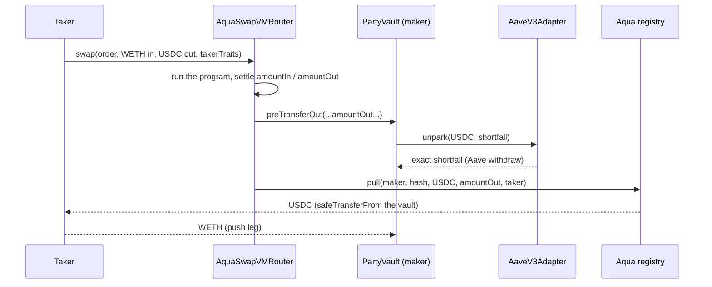

# 03. Integrations

Every external system Active Reserve touches, with the exact calls, the exact versions, and how each
one was verified. Nothing below is copied from a README: every address is asserted against live
Arbitrum on each fork-test run, and every opcode claim is asserted against the deployed router.

Related: [02_ARCHITECTURE.md](./02_ARCHITECTURE.md) for the as-built system,
[../VERIFIED.md](../VERIFIED.md) for the raw measurements, [../../RUNBOOK.md](../../RUNBOOK.md) for
operations.

---

## 1. Master address table (Arbitrum One, chain id 42161)

Single source of truth: [`contracts/src/AddressBook.sol`](../../contracts/src/AddressBook.sol). A
hardcoded address anywhere else in the Solidity tree is a review-blocking defect. The TypeScript
mirror is [`scripts/lib/addresses.ts`](../../scripts/lib/addresses.ts).

### External contracts we call

| What | Address | Role | How it was verified |
|---|---|---|---|
| Aqua registry (gen 2) | `0x1111113CCf1426A8E30e2bfF5E005d929bF6a90a` | Shared-liquidity registry. Holds our pull allowance and the strategy accounting | The gen-2 router's `AQUA()` getter returns it |
| AquaSwapVMRouter (gen 2) | `0x1111113Db0e0ef9D0E3A50d5f094a3a57a26C0DE` | The SwapVM app that quotes and settles our band, and the only address allowed to call our maker hook | `eip712Domain()` returns `("1inch SwapVM v1.0", "1.0.2")`; `AQUA()` pairs it with the registry above |
| Aave v3 Pool | `0x794a61358D6845594F94dc1DB02A252b5b4814aD` | Carry venue for the idle USDC sleeve | Matches the aToken's own `POOL()` getter |
| aArbUSDCn | `0x724dc807b04555b71ed48a6896b6F41593b8C637` | Interest-bearing receipt for the parked USDC | `UNDERLYING_ASSET_ADDRESS()` returns native USDC; `symbol()` is `aArbUSDCn` |
| Chainlink ETH/USD | `0x639Fe6ab55C921f74e7fac1ee960C0B6293ba612` | NAV valuation of the WETH leg, and band construction off chain | `decimals()` is 8; `latestRoundData()` answers positive and inside the 90-minute bound |
| USDC (native) | `0xaf88d065e77c8cC2239327C5EDb3A432268e5831` | Deposit asset, redemption asset, quoted side of the band | `symbol()` is `USDC` |
| WETH | `0x82aF49447D8a07e3bd95BD0d56f35241523fBab1` | Second registered token, the asset the band accumulates | `symbol()` is `WETH` |

### The dead generation, recorded so tooling can assert we never touch it

| What | Address |
|---|---|
| Aqua registry (gen 1, DEAD) | `0x499943e74fb0ce105688beee8ef2abec5d936d31` |
| AquaSwapVMRouter (gen 1, DEAD) | `0x8fdd04dbf6111437b44bbca99c28882434e0958f` |

### Deployed by us

| What | Address | Notes |
|---|---|---|
| PartyVault | `0xec870a6A9E8EE41B349FD0766b8f295D6EDC6610` | Verified on Arbiscan. Deploy tx `0x5b77b43198e12e0917a99d73c6238ee16b9531a429769b803daf53faf528263a`, block 487662407 |
| AaveV3Adapter | `0x6d409fF8578D017AddDB2e9Ad0848D8F0A65aBAe` | Verified on Arbiscan. Deploy tx `0x3b2b729700b60f14d1b340382d2ade637161662656d933419b26647068a855ae`, block 487662396 |
| Manager / owner | `0xc365B6795443380eb76516dA0Cedd5a00B349d66` | Immutable `OWNER` on the vault |
| Taker wallet | `0x67Fd51e5082205AF0bD97039a6124Ff3368aD0da` | Separate key, its own working capital only. Never touches vault funds |

### How the table stays honest

[`contracts/test/Launch.fork.t.sol`](../../contracts/test/Launch.fork.t.sol) forks live Arbitrum and
re-verifies the whole book on every run:

- `test_addressBook_matchesTheChain` asserts `block.chainid == 42161`, the gen-2 router/registry
  pairing, `USDC.symbol()`, `aArbUSDCn.symbol()`, the aToken's `UNDERLYING_ASSET_ADDRESS()` and
  `POOL()`, `WETH.symbol()`, the feed's `decimals() == 8`, a positive answer, and
  `block.timestamp - updatedAt <= 90 minutes`.
- `test_addressBook_doesNotReferenceTheDeadGeneration` asserts neither gen-1 address is reachable
  from `AddressBook`.

Reproduce, no setup and no keys required (public endpoint by default):

```bash
forge test --root contracts --match-path 'test/*.fork.t.sol'
pnpm verify:onchain    # the TypeScript half, read-only, no transaction sent
```

---

## 2. 1inch Aqua

### What the registry is

Aqua is a shared-liquidity registry. A maker **ships** a strategy: it registers a blob of order bytes
plus a token list and a per-token virtual balance. No tokens move at ship time (measured, trap B in
[../VERIFIED.md](../VERIFIED.md)); shipping is pure accounting. The tokens stay in the maker's own
wallet and, in our case, mostly stay parked in Aave.

The consequence that makes Active Reserve possible: Aqua's `safeBalances` never reads the maker's
ERC-20 wallet balance, so a vault holding a small hot buffer can quote the full sleeve. Only the
`pull` at settlement needs real tokens, and that is exactly where our maker hook unparks.

The maker approves the **registry**, never the router.

### Exact functions we call

Restated in [`contracts/src/interfaces/IAqua.sol`](../../contracts/src/interfaces/IAqua.sol),
transcribed from upstream `1inch/aqua` tag `v1.0.0`. Upstream source is not vendored here (see
[05_REFERENCES.md](./05_REFERENCES.md) for licensing).

| Call | Signature | Where we call it |
|---|---|---|
| `ship` | `ship(address app, bytes strategy, address[] tokens, uint256[] amounts) returns (bytes32)` | `PartyVault.execShip`, which forces `app` to the immutable `ROUTER` |
| `dock` | `dock(address app, bytes32 strategyHash, address[] tokens)` | `PartyVault._dock`, reached from `execDock` and `dockAll` |
| `rawBalances` | `rawBalances(address maker, address app, bytes32 strategyHash, address token) returns (uint248 balance, uint8 tokensCount)` | Read-only: [`scripts/status.ts`](../../scripts/status.ts), `Ops.s.sol:Smoke`, and the fork suite |

`ship`'s selector is `0xf50b870f`, cross-checked against the live gen-2 ship tx
`0xa966fc93f4519646528f082bce8640aa69146c9be9f77e4249ff446eba0fc166`. It returns
`keccak256(strategy)`, asserted against live data in `verify-onchain.ts` and again in
`Launch.fork.t.sol::_ship`.

Two behaviours of the registry shape our contract, and both are proven against the real registry
rather than a mock:

1. **`dock` reverts with `DockingShouldCloseAllTokens` unless `tokens` covers every token the ship
   registered.** So `PartyVault` stores the shipped token list per strategy hash
   (`StrategyRecord.tokens`) and replays it at dock time.
2. **A docked hash is dead forever** (`ship` requires a zero token count, and dock writes a sentinel
   instead of zero). Every roll must therefore change the program salt.
   `Launch.fork.t.sol::test_dockedHashIsDeadOnTheRealRegistry` re-ships the same bytes against the
   live registry and expects the revert, then ships the same band with a fresh salt and expects
   success. On the rehearsal this surfaced as `StrategiesMustBeImmutable` (trap G).

### The pull and push the router performs on our behalf

We never call either. The router does, inside the taker's fill.

- **`pull(address maker, bytes32 hash, address token, uint256 amount, address to)`** executes
  `safeTransferFrom(maker, to, amount)`. This is why `PartyVault._ensureAquaAllowance` grants the
  allowance to `AQUA`, not to `ROUTER`. The fork suite asserts exactly that split: allowance to the
  registry is `type(uint256).max`, allowance to the router is `0`.
- **`push`** is the mirror leg, crediting the maker with the token flowing in. Its signature is not
  restated in `IAqua.sol` because the vault never calls it; we consume only the resulting event.

### Events we consume

Decoded through the SDKs' own parsers in [`scripts/lib/events.ts`](../../scripts/lib/events.ts), so
the field mapping is never ours to get wrong.

| Event | Source | What we use it for |
|---|---|---|
| `Shipped(maker, app, strategyHash, strategy)` | `@1inch/aqua-sdk` | [`scripts/lib/reconstruct.ts`](../../scripts/lib/reconstruct.ts) rebuilds the entire order from this event. The taker never reads our database or our compiler output |
| `Docked` | `@1inch/aqua-sdk` | Lifecycle tracking |
| `Pushed(maker, token, amount)` | `@1inch/aqua-sdk` | `status.ts` counts fills and sums WETH acquired. Amount-0 pushes are skipped, because registering the empty side at ship time emits one |
| `Pulled(maker, token, amount)` | `@1inch/aqua-sdk` | `status.ts` sums USDC paid out |
| `Swapped(amountIn, amountOut)` | `@1inch/swap-vm-sdk` | `taker.ts` reads the settled amounts straight out of the receipt |

### The two generations, and how we determined which is live

There is no address "discrepancy" on Arbitrum: two complete, parallel generations are deployed, and
the upstream READMEs document the dead one.

| | Registry | Router | EIP-712 domain | Activity when measured |
|---|---|---|---|---|
| Gen 1 (dead) | `0x499943e7...` | `0x8fdd04db...` | `("AquaSwapVMRouter", "1.0.0")` | 43 ships, 579 pulls, last around 2026-04 |
| **Gen 2 (live)** | `0x1111113C...` | `0x1111113D...` | `("1inch SwapVM v1.0", "1.0.2")` | 4 ships (2026-07-20/21), 14 pulls, last 2026-07-24 |

How it was determined, all reproducible:

1. Each router's `AQUA()` getter points at its own registry, so the pairs are fixed and disjoint.
   `verify-onchain.ts` step 1 asserts both pairings and asserts the two registries differ.
2. `eip712Domain()` distinguishes them by name and version.
3. Log activity: `verify-onchain.ts` scans `Shipped` on the gen-2 registry from a fixed floor block
   (`GEN2_FIRST_ACTIVITY_BLOCK = 484000000`) and asserts the reference ship is inside the window.
4. The pinned SDKs reference only the gen-2 pair.

```bash
export ETH_RPC_URL=https://arb1.arbitrum.io/rpc
cast call 0x1111113db0e0ef9d0e3a50d5f094a3a57a26c0de "AQUA()(address)"   # gen-2 pair
cast call 0x8fdd04dbf6111437b44bbca99c28882434e0958f "AQUA()(address)"   # gen-1 pair
cast call 0x1111113db0e0ef9d0e3a50d5f094a3a57a26c0de "eip712Domain()"
```

### What one fill actually looks like



One transaction. Verified on mainnet: tx
`0xbc64ec2db39c6a8f718487268e4195c63e472f0ad0ae1f46e09919a1a9c5bb83` (block 487666888) shows an
aUSDC burn of 56,379 on the adapter, 556,382 USDC moving vault to taker via the Aqua pull, and
3e14 WETH moving taker to router to vault.

---

## 3. 1inch SwapVM

### Aqua mode: no EIP-712 signature

In Aqua mode the order carries `useAquaInsteadOfSignature`. **Shipping the encoded order to the
registry IS the authorization.** There is no signature to produce and no EIP-1271 to implement,
which is precisely why a contract like `PartyVault` can be a maker at all.

Two constraints the mode enforces, both measured: `receiver == maker` (the vault receives directly,
so there is no path that sends proceeds to an arbitrary address), and WETH unwrap is forbidden (the
vault accumulates WETH, never native ETH).

### The deployed opcode subset

The live gen-2 router runs the **pre-`OpcodeList` array dispatch** (v1.0.1 era): the opcode byte is
the array index. It does not run upstream `main` and matches no public tag. Read `swap-vm` at tag
`v1.0.1`, never `main`.

| Opcode | Instruction | | Opcode | Instruction |
|---|---|---|---|---|
| `0x00`-`0x09` | reserved (debug slots) | | `0x14` | `Controls.salt` |
| `0x0a` | `Controls.jump` | | `0x15` | `Fee.flatFeeAmountInXD` |
| `0x0b` | `Controls.jumpIfTokenIn` | | `0x16`-`0x1a` | **empty, not implemented** |
| `0x0c` | `Controls.jumpIfTokenOut` | | `0x1b` | `Fee.protocolFeeAmountInXD` |
| `0x0d` | `Controls.deadline` | | `0x1c` | `Fee.aquaProtocolFeeAmountInXD` |
| `0x0e` | `Controls.onlyTakerTokenBalanceNonZero` | | `0x1d` | `Fee.dynamicProtocolFeeAmountInXD` |
| `0x0f` | `Controls.onlyTakerTokenBalanceGte` | | `0x1e` | `Fee.aquaDynamicProtocolFeeAmountInXD` |
| `0x10` | `Controls.onlyTakerTokenSupplyShareGte` | | `0x1f` | `PeggedSwap.peggedSwapGrowPriceRange2D` |
| `0x11` | `XYCSwap.xycSwapXD` | | `0x20` | `Extruction.extruction` |
| `0x12` | `XYCConcentrate.concentrateGrowLiquidity2D` | | `0x21` | `Controls.onlyTxOriginTokenBalanceNonZero` |
| `0x13` | `Decay.decayXD` | | | |

### The measured opcode-table pointer

The table above is not transcribed from documentation. It is
`@1inch/swap-vm-sdk@0.3.0`'s `instructions.aquaInstructions` array, re-exported as
`AQUA_INSTRUCTION_SET` in [`scripts/lib/program.ts`](../../scripts/lib/program.ts), where the array
index doubles as the on-chain opcode byte.

The proof that the SDK array mirrors the deployed array exactly: `verify-onchain.ts` step 3 pulls all
four pre-existing gen-2 ships off the registry, decodes each through `AquaProgramBuilder.decode()`, and
asserts `decode -> build()` is byte-identical to the shipped program. A table that was off by even
one slot would have produced garbage arguments or thrown on the first instruction. The pre-seeded
estimate in this project's early notes was off by one across the board; the measurement corrected it.

No opcode byte is ever hand-written anywhere in this repo. Every program goes through
`AquaProgramBuilder`.

### The program we emit, and why in that order

`PRG-R1 v3`, built in [`scripts/build-orders.ts`](../../scripts/build-orders.ts):

```
[deadline][concentrateGrowLiquidity2D][flatFeeAmountInXD 80bps][xycSwapXD][salt]
```

| Position | Why it is there, and why there |
|---|---|
| `deadline` | Our own epoch guard (3 days). It must gate before anything executes, so it goes first. No live gen-2 program uses it |
| `concentrateGrowLiquidity2D` | **Shapes** the reserves into the price band. It is not a terminal curve: a concentrate program with no executing curve quotes zero and reverts `TakerTraitsAmountOutMustBeGreaterThanZero` (trap C) |
| `flatFeeAmountInXD` 80 bps | The maker premium. It must sit **before** the executing curve. A fee emitted after the curve makes the strategy unquotable, reverting `0x77e79f46` at quote time (trap C). That is a much safer failure than silently forgoing the premium |
| `xycSwapXD` | The instruction that actually **executes** the constant-product swap on the shaped reserves |
| `salt` | A documented no-op whose only effect is on the order hash. Post-curve placement costs nothing, and it must change on every roll because a docked hash is dead forever |

Two fee opcodes are deliberately absent, both for measured reasons:

- `protocolFeeAmountInXD` / `aquaProtocolFeeAmountInXD` charge **tokenIn** and pull during
  `runLoop`, before settlement transfers. On a buy band tokenIn is WETH, and our WETH side ships at
  amount 0, so the fill reverts with an arithmetic underflow, panic `0x11` (trap E). All four live
  gen-2 programs do use `aquaProtocolFeeAmountInXD`; they can afford to, because they ship both sides
  with non-zero amounts.
- The tokenOut variant does not exist. `protocolFeeAmountOutXD`, `aquaProtocolFeeAmountOutXD` and
  `flatFeeAmountOutXD` live only in `_allInstructions` (the regular SwapVM router set), never in
  `aquaInstructions`, and `AquaProgramBuilder.add()` rejects them by construction (trap F,
  asserted by `verify-onchain.ts` step 5).

### Order construction and the maker hook

```ts
const traits = MakerTraits.default().with({
  preTransferOutHook: new Interaction(Address.ZERO_ADDRESS, new HexString("0x01")),
});
const order = Order.new({ maker: new Address(vault), traits, program });
```

Two SDK details that are easy to get wrong and were measured, not inferred:

- **Zero target means "call the maker itself"**, which is what the vault wants. A non-zero target
  would call a separate hook contract.
- **The hook data must be non-empty.** The SDK's `Interaction` asserts non-empty hex bytes. The
  router does not interpret it; it forwards it as `makerHookData`. We pass one byte.

The hook itself is a fixed upstream interface, restated in
[`contracts/src/interfaces/IMakerHooks.sol`](../../contracts/src/interfaces/IMakerHooks.sol),
selector `0x5a394f80`:

```solidity
function preTransferOut(
    address maker, address taker, address tokenIn, address tokenOut,
    uint256 amountIn, uint256 amountOut, bytes32 orderHash,
    bytes calldata makerData, bytes calldata takerData
) external;
```

It fires **before** `AQUA.pull`, carrying the settled `amountOut`, which is what makes an
exact-amount JIT withdrawal possible. `PartyVault.preTransferOut` guards on
`msg.sender == ROUTER` and `maker == address(this)`, and ignores `takerData` entirely because it is
taker controlled.

Ship bytes are the **ABI-encoded Order struct** (the program lives inside the last slice of
`order.data`), not the bare program, and `strategyHash = keccak256(order bytes)`. Both are asserted
against the four live ships in `verify-onchain.ts`.

### How quoting works

A quote is an `eth_call` against the router with the **identical program bytes** the fill will use:

```ts
const data = SwapVMContract.encodeQuoteCallData({ order, tokenIn, tokenOut, amount, takerTraits });
const result = await client.call({ to: AQUA_SWAP_VM_ROUTER, data });   // eth_call, no state change
// returns (uint256 amountIn, uint256 amountOut)
```

See [`scripts/taker.ts`](../../scripts/taker.ts). Execution differs only in using
`encodeSwapCallData` and sending a real transaction. Because the program is the same object, a quote
that succeeds and a fill that succeeds are running the same code path. The gap between them is closed
on chain rather than by trust: the taker binds the dry-run quote with
`TakerTraits.default().with({ threshold: minOut })`, default 50 bps, so a quote that moves between
the dry run and execution cannot fill below the bound.

---

## 4. Aave v3

### The two calls

Restated in [`contracts/src/interfaces/IAaveV3.sol`](../../contracts/src/interfaces/IAaveV3.sol):

| Call | Signature | Used by |
|---|---|---|
| `supply` | `supply(address asset, uint256 amount, address onBehalfOf, uint16 referralCode)` | `AaveV3Adapter.park`, `referralCode` 0 |
| `withdraw` | `withdraw(address asset, uint256 amount, address to) returns (uint256)` | `AaveV3Adapter.unpark`, `to` is always the vault |

[`AaveV3Adapter`](../../contracts/src/AaveV3Adapter.sol) is deliberately tiny and final: no admin, no
owner, no rescue, no upgrade path.

- `park` pulls the underlying with `transferFrom(vault, adapter, amount)`, `forceApprove`s the pool
  for exactly that amount, and supplies on its own behalf. The adapter ends the call holding aTokens
  and zero underlying.
- `unpark` withdraws **straight to the vault** and reverts `UnparkAmountMismatch` if Aave returns
  anything other than the exact requested amount. When the reserve cannot serve the withdrawal,
  Aave's revert bubbles: the vault reads that as "temporarily illiquid", never as bad debt.
- `parkedBalance` is the raw aToken balance, which is interest-inclusive and rebases every block, so
  vault NAV picks up carry continuously without any accrual bookkeeping of our own.

### aToken accounting and why the tests carry a tolerance

An aToken balance is `scaledBalance * liquidityIndex`. A supply/withdraw round trip therefore loses a
few units to Aave's own rounding, and how many depends on the index at the block being forked. The
fork suites run against the **latest** block by design (a pinned block stops resolving on public
endpoints within days), so position assertions carry an index-robust tolerance of roughly 1e-6 of the
position: `AAVE_ROUNDING_10K = 10` units on a 10,000 USDC position, `AAVE_ROUNDING_1K = 5` on a
sub-1,000 USDC one.

The guarantee that actually matters, that `unpark` delivers the **exact** amount requested to the
vault, is asserted with `assertEq` and never with a tolerance.

### What the adapter self-checks

The constructor rejects zero addresses and then re-runs the wiring checks on chain:

```solidity
if (IAToken(aToken).UNDERLYING_ASSET_ADDRESS() != underlying
    || IAToken(aToken).POOL() != address(pool)) revert ATokenMismatch();
```

A mis-wired pool/aToken/underlying triple cannot be deployed. The vault and adapter also reference
each other immutably, so the deploy script predicts the vault address, constructs the adapter with
it, and asserts `adapter.VAULT() == address(vault)`. A wrong prediction fails the deployment instead
of producing a mis-wired pair.

### The JIT withdraw inside settlement

```solidity
uint256 buffer = IERC20(tokenOut).balanceOf(address(this));
if (buffer >= amountOut) return;
uint256 shortfall = amountOut - buffer;
ADAPTER.unpark(tokenOut, shortfall);
emit JitUnparked(tokenOut, shortfall, orderHash);
```

Capital earns interest until the block it is spent. Measured cost: **26,128 gas** of JIT overhead per
fill (92,494 with the Aave withdraw inside the fill versus 66,366 when the hot buffer covers it),
which is cents at Arbitrum gas prices and far below the 80 bps premium on any fill worth doing.

Measured yield on the fork suite: **263 bps implied APR** on a 100k USDC aUSDC position over 90
warped days. Live after the mainnet fills, the carry leg was positive and growing block by block, and
`vault.totalAssets()` cross-checked against the independently reconstructed NAV with a diff of 0.

---

## 5. Chainlink

Feed `0x639Fe6ab55C921f74e7fac1ee960C0B6293ba612`, ETH/USD, **8 decimals**. We consume the two-method
subset of `AggregatorV3Interface` restated in
[`contracts/src/interfaces/IPriceFeed.sol`](../../contracts/src/interfaces/IPriceFeed.sol):
`decimals()` and `latestRoundData()`.

### Where it is used

**On chain, NAV valuation of the WETH leg.** `PartyVault.totalAssets()` is USDC buffer plus the
parked sleeve plus WETH marked at the feed. `_wethToUsdc` reverts `InvalidPrice` on a non-positive
answer. The WETH-to-USDC scale factor `10 ** (feedDecimals + wethDecimals - usdcDecimals)` is
computed once in the constructor from the tokens' own `decimals()` getters, not hardcoded.

**Off chain, band construction.** [`scripts/build-orders.ts`](../../scripts/build-orders.ts) reads
`latestRoundData()` at build time and records the spot, so a shipped band is auditable after the
fact. [`scripts/lib/band.ts`](../../scripts/lib/band.ts) converts the 8-decimal answer into the 1e18
fixed-point raw price that `concentrateGrowLiquidity2D` expects:

```
P = tokenGt / tokenLt in RAW token units, ordered by ADDRESS, not by role
WETH (0x82aF..., 18dp) < USDC (0xaf88..., 6dp)  =>  tokenLt = WETH, tokenGt = USDC
P_x18 = answerE8 * 10^6 * 10^18 / (10^8 * 10^18)
```

`band.ts` throws if the address ordering ever changes. The identities are pinned by exact-arithmetic
tests in [`scripts/lib/band.test.ts`](../../scripts/lib/band.test.ts), and the SDK owns the sqrt
conversion via `ConcentrateGrowLiquidity2DArgs.fromRawPrices`. We never compute a sqrt price by hand.

### Measured cadence and what it implies

Sampled over 24 hours: **360 updates, median gap 121 seconds, maximum gap 29.5 minutes.**

That sets the staleness bound. A 90-minute bound sits at roughly 3x the worst observed gap, so it has
no realistic false-trip risk while still catching a genuinely stalled feed.
`Launch.fork.t.sol::test_addressBook_matchesTheChain` asserts the live feed is inside that bound on
every run, and [`scripts/status.ts`](../../scripts/status.ts) prints the answer age and warns past 90
minutes.

**Stated plainly: the in-vault staleness gate is a window cut, not an oversight.** The shipped vault
rejects a non-positive answer but does not check the answer's age; the age is watched off chain by the
status script and the manager. See [06_ROADMAP.md](./06_ROADMAP.md).

---

## 6. Tokens

| Token | Address | Decimals | Role |
|---|---|---|---|
| USDC (native, Circle) | `0xaf88d065e77c8cC2239327C5EDb3A432268e5831` | 6 | Deposit asset, sole redemption asset, the side the buy band quotes |
| WETH | `0x82aF49447D8a07e3bd95BD0d56f35241523fBab1` | 18 | Second registered token, shipped at amount 0 on a buy band, accumulated as the band fills |

### Native USDC versus USDC.e, and why the wrong one breaks

Arbitrum carries two USDC contracts: Circle's native issuance (the address above) and the older
bridged `USDC.e`. They are different ERC-20s with different Aave reserves. Picking the wrong one
breaks the build in three separate places, and at least one of them is a silent failure:

1. **The adapter would not deploy.** `aArbUSDCn`'s `UNDERLYING_ASSET_ADDRESS()` returns native USDC.
   Constructing `AaveV3Adapter` against `USDC.e` reverts `ATokenMismatch`. This one is loud, and it is
   the reason the self-check exists.
2. **The band would be priced wrong if decimals differed**, because `band.ts` derives `P_x18` from
   `DECIMALS.USDC`. This is the silent class of failure: a band nowhere near the market that still
   ships successfully.
3. **The Aqua ship would register a token nobody quotes against**, so the strategy would sit live and
   never fill.

The guard is structural: the only USDC constant in the Solidity tree is `AddressBook.USDC`, and
`Launch.fork.t.sol` asserts `symbol() == "USDC"` plus the aToken's underlying pointer on every run.

WETH matters for two non-obvious reasons beyond being the traded asset. Its **address ordering
relative to USDC** decides the numerator of the band price. And Aqua mode **forbids unwrap**, so the
vault ends up holding WETH, never native ETH, which is what `totalAssets()` marks at Chainlink.

---

## 7. Off-chain dependencies

### Pinned exactly, no caret

From [`package.json`](../../package.json), with the integrity hashes recorded in
[`pnpm-lock.yaml`](../../pnpm-lock.yaml):

| Package | Version | Integrity (prefix) |
|---|---|---|
| `@1inch/swap-vm-sdk` | `0.3.0` | `sha512-fiDiOtJ/eAn6/88W/2DwCPgjYNrL+SZnR70o...` |
| `@1inch/aqua-sdk` | `0.2.0` | `sha512-Bd27bvkS/HGMZGkfdL5LouTT+1tOwHlcTQ8m...` |
| `@1inch/sdk-core` | `0.1.2` | `sha512-EwiUiix9uAHbHXWsMyG+6TaM/DvxveJBvggv...` |
| `viem` | `2.38.6` | |
| `dotenv` | `17.2.3` | |
| `tsx` (dev) | `4.20.6` | |
| `typescript` (dev) | `5.9.3` | |
| `vitest` (dev) | `3.2.4` | |
| `@types/node` (dev) | `22.18.13` | |

**Why exact and not a caret range.** The opcode table lives inside the SDK
(`instructions.aquaInstructions`), and the deployed gen-2 router does not run upstream `main` and
matches no public tag. It uses the pre-`OpcodeList` array dispatch where opcode equals array index.
Under `main`'s banked enum the same logical instructions sit at different bytes. A caret range that
silently pulled an SDK built against `main` would emit a program that is syntactically valid and
semantically wrong. Pin exact, never hand-write an opcode byte, and always build through
`AquaProgramBuilder`.

### Solidity toolchain

From [`contracts/foundry.toml`](../../contracts/foundry.toml):

| Setting | Value | Note |
|---|---|---|
| `solc` | `0.8.28` | |
| `optimizer` | on, `1_000_000` runs | |
| `evm_version` | `cancun` | Arbitrum One runs an ArbOS release with full Cancun support; the live Aqua registry is itself compiled for it |
| fuzz runs | 512 default, 2,000 in the `ci` profile | |

Dependencies are **git submodules pinned by commit**, not vendored copies:

| Submodule | Commit |
|---|---|
| `contracts/lib/openzeppelin-contracts` | `69c8def5f222ff96f2b5beff05dfba996368aa79` |
| `contracts/lib/forge-std` | `b93cf4bc34ff214c099dc970b153f85ade8c9f66` |

No upstream Aqua or SwapVM Solidity is vendored here. The four interface files under
`contracts/src/interfaces/` restate only the ABI shapes we call, and each cites the upstream tag it
was transcribed from (`aqua` v1.0.0, `swap-vm` v1.0.1). See
[05_REFERENCES.md](./05_REFERENCES.md) for the licensing position.

### Reproducing the pinning check

```bash
pnpm install --frozen-lockfile   # fails if package.json and pnpm-lock.yaml disagree
git submodule status             # prints the two commits in the table above
pnpm typecheck && pnpm test      # tsc --noEmit, then vitest (band math identities)
pnpm verify:onchain              # THE pin check that matters, see below
```

`pnpm verify:onchain` is the check that would catch an SDK drift. Step 3 decodes every live gen-2
ship through the pinned SDK and asserts `decode -> build()` reproduces the shipped program bytes
exactly. If a future SDK version stopped mirroring the deployed opcode array, that assertion fails
loudly against real on-chain data instead of letting a wrong program reach a ship.

For the execution-dependent claims, `pnpm fork:all` runs the full rehearsal,
the seven traps, and the taker loop on a throwaway Anvil fork. Fork transaction hashes are per-run, so
the reproducible artifact is the script, not a hash list.

---

## 8. What we deliberately do not integrate

Each of these is a decision with a reason, not a gap we failed to notice.

### No aggregator routing, and no swap function on the vault

The vault has no `swap`. Funds leave through exactly three paths: `redeem` to the share holder, Aqua
settlement against a strategy the owner shipped, or into the carry adapter. There is no path that
sends an arbitrary amount to an arbitrary address. Adding 1inch aggregator or Fusion routing would
add a fourth, and auditing it was not in the window.

The consequence is that accumulated WETH inventory leaves the way it arrived: through a fill, in
reverse ([`scripts/unwind.ts`](../../scripts/unwind.ts), taker pays USDC and receives WETH).

**One operational finding worth reading, because it cost us a revert on mainnet.**
`_ensureAquaAllowance` only tops up the allowance for what a ship actually commits, and a buy band
ships WETH at amount 0. So the vault has **no WETH allowance to Aqua at all**, and a reverse fill
reverts inside `pull`'s `safeTransferFrom` with no reason string until the owner grants one. That is
correct behaviour for a one-directional band, not a bug, but the exit needs one deliberate
transaction first, and it must happen **before** `EmergencyStop` revokes everything and docks the
strategies. `revokeAquaApproval` is a general allowance setter despite its name (zero revokes, any
other value grants). Full procedure in [../../RUNBOOK.md](../../RUNBOOK.md) section 7b.

### No keeper infrastructure

No cron, no bot service, no automation account, no separate KEEPER role. Rolls, re-parks, docks and
the emergency stop are manual owner transactions from
[`contracts/script/Ops.s.sol`](../../contracts/script/Ops.s.sol) (`SeedAndPark`, `ShipBand`, `Smoke`,
`EmergencyStop`). The price sentinel is the manager plus `dockAll()`.

The window's capital was the manager's own seed under a `maxTvl` of 200 USDC, which is what makes
that acceptable. It would not be at scale. See [06_ROADMAP.md](./06_ROADMAP.md).

### No database in this repository

No Postgres, no Drizzle, no ORM, no connection string. The Neon mirror and its schema live only in the
frontend branch, and no data from it is committed anywhere, because this repo is public.

That constraint produced a better design rather than a worse one:
[`scripts/lib/reconstruct.ts`](../../scripts/lib/reconstruct.ts) rebuilds a live strategy entirely
from its on-chain `Shipped` event. The taker never reads our database or our compiler output, so a
stranger with nothing but an RPC endpoint and a strategy hash gets the same order, the same quote,
and the same fill we do. That is also the honest way to show the strategy is real rather than a
private arrangement between our own scripts.

### No PartyRouter, so no in-program oracle guard

`PartyRouter` with the `OraclePriceAdjuster` instruction wired (the modified-SwapVM axis) is designed
and specified but was not shipped in the window. The band is therefore static within an epoch, and the
manager plus `dockAll` is the sentinel. Detailed in [06_ROADMAP.md](./06_ROADMAP.md).

### No price API

The only price source anywhere in this system is the Chainlink feed on chain. No CoinGecko, no
exchange API, no off-chain oracle. The status script and the order builder read the same feed the
vault reads.
