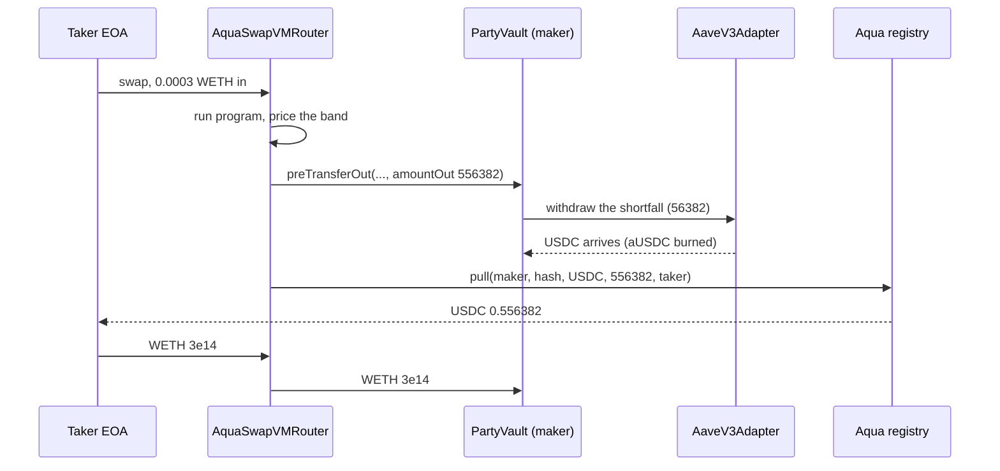

# Qualification: every requirement mapped to live evidence

Active Reserve is a pooled vault that keeps about 95 percent of its USDC earning Aave v3 supply
yield behind a 5 percent hot buffer, and registers a sleeve worth about 10 percent of TVL with
the official 1inch Aqua registry as virtual balance as a below-spot buy band
written as a SwapVM program. A maker hook withdraws from Aave inside the settlement transaction, so
parked capital is quotable liquidity.

This page exists so a reviewer can check that claim rather than take it. Every row below links to a
transaction, a contract, a file or a command.

## Scorecard

| # | Requirement | Status | Shortest proof |
|---|---|---|---|
| a | Custom Aqua app implementing a sophisticated DeFi position | Met | [`contracts/src/PartyVault.sol`](../../contracts/src/PartyVault.sol) is the Aqua maker; the JIT trace is decoded in [`docs/FILLS.md`](../FILLS.md) |
| b | SwapVM usage (modifying opcodes and defining new instructions allowed, scores higher) | Met for usage, NOT for modification | Programs compiled through `@1inch/swap-vm-sdk@0.3.0`; the deployed instruction array measured, not assumed ([`docs/VERIFIED.md`](../VERIFIED.md)). The modified router was cut, see the caveat |
| c | Official Aqua and SwapVM contracts used | Met | Registry `0x1111113C...a90a` and router `0x1111113D...C0DE`, hard-coded in [`AddressBook.sol`](../../contracts/src/AddressBook.sol) and re-verified against the chain by a fork test |
| d | On-chain execution of token transfers in the final demo (local forks acceptable) | Exceeded | The Arbitrum One transactions of the run, three of them real fills. Forks were the rehearsal, mainnet was the demo |
| e | Proper git commit history, no single-commit entries | Met | 29 commits, five squash-merged PRs, one Linear issue per PR |
| f | Open source, public repo | Met | [github.com/0xmvercosa/pool-party-aqua](https://github.com/0xmvercosa/pool-party-aqua), MIT ([LICENSE](../../LICENSE)), both contracts verified on Arbiscan |

---

## (a) A custom Aqua app implementing a sophisticated DeFi position

**What we built.** `PartyVault` is an Aqua maker: a pooled USDC vault with ERC-4626 share math and
an internal, non-transferable share ledger. It supplies its idle balance to Aave v3 through
`AaveV3Adapter`, keeps a small hot buffer, and ships a buy band below spot to Aqua. When a taker
fills, the router calls the vault's `preTransferOut` hook before pulling funds, and the vault
withdraws from Aave exactly the shortfall beyond the hot buffer, in the same transaction.

**Why this is a position and not a wrapper.** The vault holds two positions on the same dollar at
once: an Aave supply position and a resting bid. They do not compete, because Aqua's `safeBalances`
never reads the maker's ERC-20 wallet balance (see [`docs/VERIFIED.md`](../VERIFIED.md), program-shape
fact 1). A vault holding 0.5 USDC hot can quote a band worth the whole sleeve, and only `pull` at
settlement needs real tokens, which the hook supplies just in time.

**This is not possible with a normal AMM position.** Concentrated liquidity in a v3-style pool sits
in the pool contract and earns nothing while it waits. Here the same capital earns Aave interest up
to the instant it is spent.



**Verify it.**

- Maker and hook: [`contracts/src/PartyVault.sol`](../../contracts/src/PartyVault.sol), hook interface
  restated in [`contracts/src/interfaces/IMakerHooks.sol`](../../contracts/src/interfaces/IMakerHooks.sol).
- Carry venue: [`contracts/src/AaveV3Adapter.sol`](../../contracts/src/AaveV3Adapter.sol). Its
  constructor re-checks the aToken through `UNDERLYING_ASSET_ADDRESS()` and `POOL()`, so a mis-wired
  pair cannot deploy.
- The mechanism on mainnet, decoded event by event: [`docs/FILLS.md`](../FILLS.md), transaction
  [`0xbc64ec2d`](https://arbiscan.io/tx/0xbc64ec2db39c6a8f718487268e4195c63e472f0ad0ae1f46e09919a1a9c5bb83).
  One transaction contains the aUSDC burn (56,379), the USDC payment to the taker (556,382) and the
  WETH landing in the vault.
- Tests: 62 Foundry tests (38 vault unit, 6 differential against OpenZeppelin's `ERC4626`, 13 adapter
  fork, 5 launch fork). `forge test --root contracts`.

**Caveat, stated plainly.** The sleeve was 1.0 USDC on a 10.0 USDC vault, the smallest size that
still exercises every path. The mechanism is size independent; the capital at risk was deliberately
not.

---

## (b) SwapVM usage

**What we did.** Every strategy is a SwapVM program. We never hand-wrote opcode bytes: programs are
built with `AquaProgramBuilder` from `@1inch/swap-vm-sdk@0.3.0`
([`scripts/lib/program.ts`](../../scripts/lib/program.ts), [`scripts/build-orders.ts`](../../scripts/build-orders.ts)).

The canonical program for a band, measured and then frozen as rule PRG-R1 v3:

```
[deadline][concentrateGrowLiquidity2D][flatFeeAmountInXD 80bps][xycSwapXD][salt]
```

**We measured the deployed machine instead of trusting the docs, and that mattered.**

- Two complete Aqua generations are deployed on Arbitrum. The upstream READMEs document the dead one.
  We measured which is live and pinned to it.
- The live router runs the pre-`OpcodeList` array dispatch (v1.0.1 era, opcode equals array index),
  so `swap-vm` must be read at tag `v1.0.1`, never `main`. Our first estimated opcode table was off
  by one across the board; the measured table is in [`docs/VERIFIED.md`](../VERIFIED.md).
- Proof the table is right: all four live generation-2 ships decode through our builder and re-build
  to byte-identical program bytes. A one-off table would have thrown on the first instruction.
  Reproduce with `pnpm verify:onchain`, read-only, no transaction sent.

**Seven failure modes demonstrated on-chain**, not reasoned about
([`pnpm rehearse:traps`](../../scripts/rehearse-traps.ts), table in [`docs/VERIFIED.md`](../VERIFIED.md)).
Two are worth a judge's time:

- **Trap C.** A fee emitted after the executing curve does not get silently skipped, as the upstream
  note suggests. The strategy becomes unquotable (`0x77e79f46`). A mis-ordered program can therefore
  never reach a fill, which is a safer failure than quietly forgoing the premium.
- **Trap F.** The Aqua instruction set has no `*AmountOut*` fee opcode at all. The tokenIn variants
  charge during `runLoop`, and a buy band ships WETH at amount 0, so an on-chain protocol fee would
  make every fill revert (trap E, panic 0x11). That is why the protocol fee is out of v1, and the
  reason is measured rather than assumed.

**The honest caveat on this requirement.** The rules allow modifying opcodes and redeploying a
modified SwapVM, and that scores higher. **We did not do it.** `PartyRouter`, a redeploy of the
official SwapVM with a single `OraclePriceAdjuster` instruction claimed in one opcode slot, is fully
designed and specified (rules RTR-R1 to RTR-R7 in [`docs/01_BUSINESS_RULES.md`](../01_BUSINESS_RULES.md))
and was consciously cut from the build window. There is no PartyRouter source in this repository, and
you should not credit us for one. See [06_ROADMAP.md](./06_ROADMAP.md).

---

## (c) Official Aqua and SwapVM contracts, used unmodified

| Role | Address | Note |
|---|---|---|
| Aqua registry (generation 2, live) | [`0x1111113CCf1426A8E30e2bfF5E005d929bF6a90a`](https://arbiscan.io/address/0x1111113CCf1426A8E30e2bfF5E005d929bF6a90a) | the vault ships, docks and approves here |
| AquaSwapVMRouter (generation 2, live) | [`0x1111113Db0e0ef9D0E3A50d5f094a3a57a26C0DE`](https://arbiscan.io/address/0x1111113Db0e0ef9D0E3A50d5f094a3a57a26C0DE) | EIP-712 domain ("1inch SwapVM v1.0", "1.0.2") |
| Aqua registry (generation 1, DEAD) | `0x499943e74fb0ce105688beee8ef2abec5d936d31` | what the upstream READMEs document. Not used |
| AquaSwapVMRouter (generation 1, DEAD) | `0x8fdd04dbf6111437b44bbca99c28882434e0958f` | not used |

We deployed no Aqua contract and no SwapVM contract. The only contracts we deployed are our own
maker and its carry adapter, listed in the ledger below.

Two details that show the integration is real rather than nominal:

- **The vault approves the registry, never the router.** `Aqua.pull` executes
  `safeTransferFrom(maker, to, amount)` from the maker, so an allowance to the router would be
  useless. `Launch.fork.t.sol` asserts the router allowance is zero on every fork run, and the `Smoke` op prints all four allowances with a warning if the router ever holds one.
- **The Aqua app is forced to the canonical router.** Shipped liquidity cannot be pointed at some
  other venue, which is why we could ship without a token allowlist inside the window.

**Verify it.** [`contracts/src/AddressBook.sol`](../../contracts/src/AddressBook.sol) carries every
address with a note on how it was verified, and
`LaunchForkTest.test_addressBook_matchesTheChain` in
[`contracts/test/Launch.fork.t.sol`](../../contracts/test/Launch.fork.t.sol) re-reads each one from
live Arbitrum, including that the router's `AQUA()` getter points at the generation-2 registry. The
docs cannot rot silently.

```bash
export ETH_RPC_URL=https://arb1.arbitrum.io/rpc
cast call 0x1111113db0e0ef9d0e3a50d5f094a3a57a26c0de "AQUA()(address)"
cast call 0x1111113db0e0ef9d0e3a50d5f094a3a57a26c0de "eip712Domain()"
```

---

## (d) On-chain execution of token transfers in the final demo

Local forks are acceptable for this requirement. **We used forks as the rehearsal and settled the
demo on Arbitrum One mainnet.**

- Fork work (`pnpm fork:all`): a 28-check approve to ship to quote to swap to dock loop, the seven
  traps, and a full taker loop that reconstructs the order from chain and fills it, including the
  oversized JIT fill. Fork transaction hashes are per-run under Anvil, so the reproducible artifact
  is the script, not a hash list ([`docs/FILLS_FORK.md`](../FILLS_FORK.md)).
- Mainnet: nine transactions, three of which are fills that moved USDC out of the vault and WETH in.
  All three took the JIT path.

### The mainnet ledger

Arbitrum One (chain id 42161), 2026-07-25. Manager and vault owner
[`0xc365B6795443380eb76516dA0Cedd5a00B349d66`](https://arbiscan.io/address/0xc365B6795443380eb76516dA0Cedd5a00B349d66);
taker [`0x67Fd51e5082205AF0bD97039a6124Ff3368aD0da`](https://arbiscan.io/address/0x67Fd51e5082205AF0bD97039a6124Ff3368aD0da),
a separate wallet with no privilege over the vault.

| # | What | Block | Detail | Tx |
|---|---|---|---|---|
| 1 | Deploy `AaveV3Adapter` | 487662396 | [`0x6d409fF8578D017AddDB2e9Ad0848D8F0A65aBAe`](https://arbiscan.io/address/0x6d409fF8578D017AddDB2e9Ad0848D8F0A65aBAe), verified | [`0x3b2b7297...`](https://arbiscan.io/tx/0x3b2b729700b60f14d1b340382d2ade637161662656d933419b26647068a855ae) |
| 2 | Deploy `PartyVault` | 487662407 | [`0xec870a6A9E8EE41B349FD0766b8f295D6EDC6610`](https://arbiscan.io/address/0xec870a6A9E8EE41B349FD0766b8f295D6EDC6610), verified, `maxTvl` 200 USDC | [`0x5b77b431...`](https://arbiscan.io/tx/0x5b77b43198e12e0917a99d73c6238ee16b9531a429769b803daf53faf528263a) |
| 3 | Seed | | manager seeds first (VLT-R2): 10 USDC, 10e9 shares | [`0x0cfc605e...`](https://arbiscan.io/tx/0x0cfc605e070923cbe816b1656d76fd2889cc209de21105742ee45e380d22bbf3) |
| 4 | Park to Aave v3 | | 9.5 USDC supplied, 0.5 USDC hot buffer | [`0x05383f15...`](https://arbiscan.io/tx/0x05383f15007141f67a8c7c8528390e8fb3f9b0e3ffc80e89e4b9d25dfc2c4787) |
| 5 | Ship DEMO band | 487665802 | hash `0x77097fd3...`, 0.6 USDC virtual, band 1867.56 to 1871.30 USD | [`0x988f774a...`](https://arbiscan.io/tx/0x988f774a1284fd6fbcf6e7c6afde30b9b6550da04d8edbe060f40c522b130ba9) |
| 6 | Ship PRODUCTION band | 487666286 | hash `0xafbd59da...`, 0.4 USDC virtual, band 1592.20 to 1779.52 USD | [`0xdbebc9ca...`](https://arbiscan.io/tx/0xdbebc9caa1ddd2f2164db6f435605e1512fc3bc293328680f7079971e8ed094d) |
| 7 | **Fill 1 (the money shot)** | 487666888 | 0.0003 WETH in, 0.556382 USDC out at 1854.61, JIT path, 336k gas | [`0xbc64ec2d...`](https://arbiscan.io/tx/0xbc64ec2db39c6a8f718487268e4195c63e472f0ad0ae1f46e09919a1a9c5bb83) |
| 8 | Fill 2 | | 0.00002 WETH in, 0.037055 USDC out, buffer now empty, served from Aave | [`0x94068a6b...`](https://arbiscan.io/tx/0x94068a6b87198ba8190830542cf91bcfab6800be6f33efac8ac6012b8f9e7a2d) |
| 9 | Fill 3 | | 0.00002 WETH in, 0.035137 USDC out, on the PRODUCTION band | [`0x22275ab5...`](https://arbiscan.io/tx/0x22275ab56618064191e0bbcff058389722a3a1c9d54b14a89c5c0e10316a89f1) |

Deploy gas for rows 1 and 2 combined: 0.0000686 ETH.

The full strategy hashes are
`0x77097fd33011a87bf7a5be80dde5043f28bfaa130758ab77363133f0120810cf` (demo) and
`0xafbd59da3040256990b3584b56930acd0befc0ee1ccbfa7bc87b0c7496818260` (production).

Two things this ledger shows that are easy to miss:

1. **Rows 5 and 6 move no tokens.** Shipping is an accounting write in the Aqua registry. The vault's
   `totalAssets` is identical before and after, which is the entire point of the model.
2. **Combined shipped USDC was 1.0 on a 10.0 USDC vault**, exactly the 10 percent sleeve the rules
   require (PRG-R5, PRG-R6), with the other 9.5 earning Aave interest the whole time.

### Read row 7 carefully

Decoded from the receipt: aUSDC burn 56,379 on the adapter, USDC 556,382 from the vault to the taker
via Aqua's `pull`, WETH 3e14 from the taker through the router into the vault. The vault owed 556,382
and its wallet held 500,000, so it withdrew from Aave exactly 56,382, the shortfall and not a unit
more. Until that transaction executed, every one of those units was earning interest.

### State after the fills

Read fresh from chain with `pnpm status`:

- NAV 10.008642 USDC, cross-checked against the vault's own `totalAssets()`, difference 0.
- Dip leg +0.008636 USDC: 0.00034 WETH bought at an average of 1848.75, which is 1.36 percent below
  spot.
- Aave carry positive and growing block by block.

### Evidence the design refuses bad debt

When the demo band ran out of depth, the next fill **reverted** with an arithmetic underflow inside
`pull` rather than over-committing the maker. That revert is the safety property, observed live, not
a bug we worked around.

### Close-out

After the demo we sold the inventory back through reverse fills, ran `EmergencyStop` (`dockAll` plus
revoking both Aqua allowances), set `maxTvl` to 0 and redeemed 9.956441 USDC to the manager. About
0.0000285 WETH (roughly 5 US cents) remains in the vault as residual inventory. Those close-out
transactions are visible on the
[vault's Arbiscan page](https://arbiscan.io/address/0xec870a6A9E8EE41B349FD0766b8f295D6EDC6610) but we
did not record their hashes in the repo, so we do not list them here.

One operational finding from the close-out is written up in
[`RUNBOOK.md`](../../RUNBOOK.md) section 7b: `_ensureAquaAllowance` only tops up for what a ship
commits, and a buy band ships WETH at amount 0, so the vault has **no** WETH allowance to Aqua.
Selling inventory back needs an explicit owner approval, and it has to happen before `EmergencyStop`
revokes everything. Correct behaviour for a one-directional band, and it cost us a revert to learn.

---

## (e) Git commit history

29 commits on `main`, first `e37ddad` at 2026-07-25 13:34 and last `9c3ccfd` at 2026-07-26 00:51
(commit timestamps). Five squash-merged pull requests, each tied to one Linear issue:

| PR | Commit | Scope |
|---|---|---|
| #1 | `90ce37e` | `PartyVault` demo minimum plus the Foundry workspace [POO-1059] |
| #3 | `9cc278d` | generation-2 ground truth, fork rehearsal, trap proofs [POO-1058] |
| #4 | `dc31b0e` | launch scripts, RUNBOOK, fork rehearsal against the real Aqua [POO-1062] |
| #5 | `34e754f` | taker and status scripts, green on the fork [POO-1066, POO-1065] |
| #6 | `12e5408` | `AaveV3Adapter` plus the Arbitrum fork suite [POO-1060] |

Branches follow `<type>/<area>-poo-<num>-<slug>`; commit subjects carry the Linear key.

```bash
git log --oneline            # 29 entries
git log --format='%h %ad %s' --date=short
```

**Caveat.** PR #2 does not appear in the merged history: it was opened and not merged. The launch
record, the fills and the walkthrough landed as direct commits on `main` during the live run rather
than through PRs, because those documents have to be written while transactions are confirming. Every
piece of code went through a PR; some of the documentation did not.

---

## (f) Open source, public repo

- Repository: [github.com/0xmvercosa/pool-party-aqua](https://github.com/0xmvercosa/pool-party-aqua),
  public.
- License: MIT, [`LICENSE`](../../LICENSE). The scope note there is explicit that our code calls the
  1inch contracts but is not derivative of them.
- Both deployed contracts are source-verified on Arbiscan (Etherscan API V2, 2026-07-25):
  [PartyVault](https://arbiscan.io/address/0xec870a6A9E8EE41B349FD0766b8f295D6EDC6610#code),
  [AaveV3Adapter](https://arbiscan.io/address/0x6d409fF8578D017AddDB2e9Ad0848D8F0A65aBAe#code).
- No upstream Degensoft source is vendored. Our interface files restate only the ABI shapes we call
  and cite the upstream tag they were transcribed from
  ([`IAqua.sol`](../../contracts/src/interfaces/IAqua.sol) at `1inch/aqua` `v1.0.0`,
  [`IMakerHooks.sol`](../../contracts/src/interfaces/IMakerHooks.sol) at `1inch/swap-vm` `v1.0.1`).
  Full terms in [05_REFERENCES.md](./05_REFERENCES.md).
- No secrets, keys or database credentials are committed. Environment values live only in local
  `.env` files.

**Scope note on the app side.** The investor and manager surfaces live in a private product repo that
predates the event. Every on-chain-facing artifact (contracts, deploy scripts, program compiler,
taker, status, rehearsals, docs) is in this public repo, so every claim on this page is checkable
without access to the private one.

---

## Reproduce it yourself

The whole run, from an empty machine to live fills, is written out command by command in
[`docs/05_DEMO_WALKTHROUGH.md`](../05_DEMO_WALKTHROUGH.md). About 15 minutes and roughly 0.30 USD of
gas. Note that the walkthrough is parameterised slightly differently from the live run (it seeds 9.5
USDC); the ledger above is what actually happened.

Nothing below spends money:

```bash
git clone https://github.com/0xmvercosa/pool-party-aqua.git && cd pool-party-aqua
git submodule update --init --recursive && pnpm install

cd contracts && forge test && cd ..    # 62 tests, fork suites included
pnpm verify:onchain                    # read-only vs Arbitrum: which Aqua is live,
                                       # the opcode table, builder round-trip on all 4 live ships
pnpm fork:all                          # rehearsal + traps + taker on a throwaway fork
```

`pnpm verify:onchain` is the one to run if you only run one. It reproduces the ground truth this
whole submission rests on without sending a transaction.

---

## What we are NOT claiming

Stated here so nobody has to dig for it.

1. **We did not ship a modified SwapVM.** `PartyRouter` with the `OraclePriceAdjuster` instruction is
   designed and specified, and cut. No source for it exists in this repo.
2. **The fills are self-directed settlement proofs**, executed by our own taker against our own
   strategy. They are not arbitrage profit and not organic demand. A band bidding below spot cannot
   win arbitrage by construction: it becomes the best bid only when the market falls into it.
3. **The only external, real yield in this window is the Aave carry**, which accrues every block
   whether anyone fills or not. The 80 bps band premium is real in mechanism and trivial in absolute
   terms at a 1.0 USDC sleeve.
4. **The in-vault Chainlink staleness gate, the keeper loop, the separate keeper role, the lockup,
   the high-water-mark performance fee, `maxPerShip` and token allowlists are all cut.** During the
   window, manager watch plus `dockAll` is the price sentinel, and the runbook says so.
5. **This is not a live retail product.** It ran under hard caps with our own capital, and it is
   docked and capped at zero after the event pending audit and licensing.
6. **No audit.** 62 tests and a fork rehearsal are not an audit.

Further reading: [01_WHAT_WE_BUILT.md](./01_WHAT_WE_BUILT.md),
[02_ARCHITECTURE.md](./02_ARCHITECTURE.md), [03_INTEGRATIONS.md](./03_INTEGRATIONS.md),
[05_REFERENCES.md](./05_REFERENCES.md), [06_ROADMAP.md](./06_ROADMAP.md),
[07_PROCESS.md](./07_PROCESS.md).
