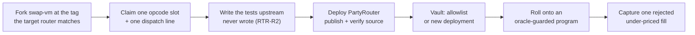
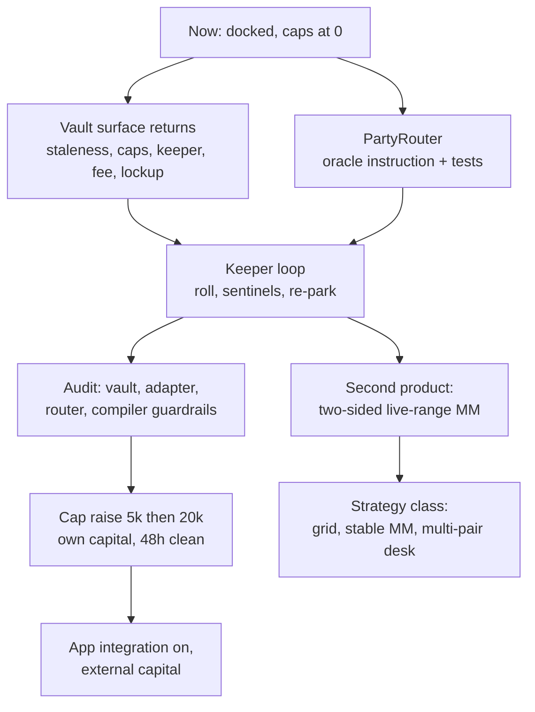

# Roadmap: what is designed, what is deferred, and what comes next

Active Reserve shipped as the demo minimum of a much larger specification. This file is the rest of
that specification: what exists on paper with a rule number attached, why it was cut from a
20-hour window, and what each piece costs to finish.

Two reading rules. First, everything called "deferred" here is a numbered rule in
[01_BUSINESS_RULES.md](../01_BUSINESS_RULES.md), not a gap we noticed afterwards; the cut table in
the [README](../../README.md) is the short version. Second, where a planning document disagrees
with the code or with [VERIFIED.md](../VERIFIED.md), the code and VERIFIED.md win: the plan was
written before the chain was measured.

For what actually shipped, read [02_ARCHITECTURE.md](./02_ARCHITECTURE.md) first; this file only
covers what did not.

---

## 1. Designed, specified, deliberately not shipped

| Deferred | Rule | What we do instead today | Cost to finish |
|---|---|---|---|
| In-vault Chainlink staleness gate | VLT-R4 | NAV reverts on a non-positive answer only; the 90-minute bound is watched off chain | one feed field, one revert, a test matrix |
| Redemption lockup | VLT-R6 | lockup is 0 days for the event (D4) | per-deposit lot ledger plus a redeem gate |
| Separate KEEPER role | VLT-R7 | one immutable owner, every operation manual from the CLI | a second bounded role, key separation |
| High-water-mark performance fee | VLT-R8 | platform economics documented, not charged | HWM state plus `accrueFee()`, share-math tests |
| `maxPerShip` and token allowlists | VLT-R7, VLT-R10 | `maxTvl` only, plus an immutable router as the Aqua app | two checks in `execShip` |
| PartyRouter with the oracle instruction | RTR-\* | manager watch plus `dockAll` is the price sentinel | see section 2 |
| Keeper loop (roll, sentinels, re-park) | KPR-\* | manual roll, manual re-park, `dockAll` as the safety | needs the keeper role first |
| Manager UI | POO-1068 | the CLI scripts are the manager demo | a mandate form over the existing compiler |
| On-chain protocol fee per fill | PRG-R7 v3 | 80 bps flat fee only, accruing to the maker | blocked upstream, see below |

**Staleness gate (VLT-R4).** The shipped vault values WETH at Chainlink and reverts `InvalidPrice`
on a non-positive answer ([PartyVault.sol](../../contracts/src/PartyVault.sol)), but it does not
read `updatedAt`. The rule wants deposit and redeem to revert past `maxStaleness` (90 minutes,
D9). The measured feed behaviour says that bound is safe: 360 updates in 24 hours, median gap 121
seconds, worst gap 29.5 minutes ([VERIFIED.md](../VERIFIED.md)). It was cut because a staleness
gate that trips wrongly bricks deposits and redemptions at exactly the moment an operator wants
them working, and with one human watching a 10 USDC vault the off-chain watch (`pnpm status`) was
the better trade for a day. It is the first item back for external capital.

**Lockup (VLT-R6).** Set to 0 days for the event, so the code path would have been unobservable.
Shares are non-transferable by construction (VLT-R3), which makes per-deposit lots simple: no
transfer can split a lot. The interaction that needs care is the honest illiquidity state
([RUNBOOK section 8](../../RUNBOOK.md)): a lockup and an `InsufficientLiquidUsdc` revert are
different things, and investor copy must never merge them.

**Keeper role (VLT-R7).** The shipped vault has a single immutable owner and no ownership
transfer, so key rotation means deploying a new vault. That is acceptable at 200 USDC of cap and
removes a whole class of admin risk, but it also means the only key that can roll a band is the
manager key, which is why the keeper loop could not run unattended. The role is bounded by
design: ship, dock, dockAll and park within caps, with no path that moves funds to an arbitrary
address.

**Performance fee (VLT-R8).** 20 percent on the share-price high-water mark, minted as shares to
the manager. A global HWM is sound precisely because shares cannot be transferred. Charging it
in-window would have meant charging ourselves a fee on our own 10 USDC while adding a rounding
surface that the differential suite against OpenZeppelin ERC-4626 would have to re-cover. It
returns with external capital, not before.

**Per-ship caps and allowlists (VLT-R7, VLT-R10).** Aqua ship amounts are the literal blast radius
of a strategy, so a per-token ship cap is a real control rather than a cosmetic one. In-window the
substitute is structural: `maxTvl` bounds the whole vault, and the Aqua app is forced to the
immutable `ROUTER`, so the owner cannot point vault liquidity at an arbitrary app (see the
`execShip` contract comment). The caps matter the moment a keeper or a second manager can ship.

**On-chain protocol fee (PRG-R7 v3).** This one is not a scheduling cut, it is a measured upstream
constraint. `aquaProtocolFeeAmountInXD` charges the **tokenIn** side and pulls during `runLoop`; a
buy band ships WETH at amount 0, so the fill reverts with an arithmetic underflow (trap E). The
tokenOut variant does not exist in the Aqua instruction set at all: slots 0x16 to 0x1a are empty
and `AquaProgramBuilder.add()` rejects the regular-SwapVM variants by construction (trap F). Three
routes back, in order of preference: a two-sided band funds tokenIn and can afford the opcode
exactly as all four live gen-2 makers do; 1inch adds a tokenOut fee opcode to the Aqua set (see
section 6); or we wire our own fee instruction into PartyRouter. Until one of those lands, Pool
Party's take rate on this class is off-chain bookkeeping, which is the opposite of the "fees
become code" pitch.

---

## 2. PartyRouter: the modified-SwapVM axis

The hackathon explicitly allows a modified SwapVM redeploy, and upstream left an obvious opening.
`src/instructions/OraclePriceAdjuster.sol` exists complete in the SwapVM repository: it reads a
Chainlink `AggregatorV3` feed, checks staleness, and clamps the price the program may quote by
`maxPriceDecay`. It has **no opcode slot and no tests**, so nothing on any deployed router can
execute it. Wiring it is our chosen contribution and it is specified in full (RTR-R1 to R7); it
was cut on the 20-hour clock and named as cut everywhere rather than implied.

**What the work is.** RTR-R1 bounds the diff: one slot claim in the opcode table, one dispatch
line, one router contract inheriting the official SwapVM. The dispatch chain upstream is
`internal virtual`, so no upstream source needs modifying beyond the claim. The real work is the
part upstream never did: RTR-R2 requires quote and swap parity with the adjuster active, a
staleness revert test, `maxPriceDecay` clamping proven in both directions, and fuzzing. Params
come from D9: 50 bps decay, 90 minutes staleness, feed address passed as a program argument
(RTR-R3). Source gets published and verified (RTR-R4), which the Degensoft copyleft requires
anyway. The compiler emits the instruction only when the target is PartyRouter (RTR-R6), and the
evidence artifact is one under-priced fill visibly rejected on chain (RTR-R7).

**What it buys an investor.** Today the only thing standing between a band and a market that has
moved is a human with `dockAll`. Between manager interventions the strategy quotes whatever its
curve says, and the curve does not know what ETH is worth. With the adjuster in the program, the
quote is clamped against the oracle inside the fill: a taker cannot lift the band more than
`maxPriceDecay` through the market price, and a stale feed makes the fill revert instead of
settling blind. That converts "the manager is watching" into "the strategy is bounded", which is
the difference between a demo and something an investor can be left alone with overnight.

**Two risks we measured, both real.**

*Version archaeology.* The deployed gen-2 router does not run `main` and does not match any public
tag: it runs the pre-`OpcodeList` array dispatch, where the opcode is the array index
([VERIFIED.md](../VERIFIED.md)). A router forked from `main` would compile against the banked enum
and emit bytes the deployed router does not have, and the compiler would happily produce programs
for the wrong table. The discipline that follows is mechanical: pin the upstream tag per router
address, keep the opcode table an attribute of the deployment rather than of the codebase, and
keep the SDK pinned exact (`@1inch/swap-vm-sdk@0.3.0`). Running the official router as a
documented fallback (RTR-R5) means two tables in flight at once, so the compiler must key on the
router address, not on a global constant.

*The vault forces one router.* RTR-R5 was written assuming a `routerAllowlist`. The vault that
actually shipped has `address public immutable ROUTER` and no allowlist, because VLT-R7 was
reduced to a single owner for the window. Migrating a live strategy onto PartyRouter therefore
means either reintroducing the allowlist (deferred item, section 1) or deploying a new vault and
moving the capital. That is a deliberate consequence of the window cut, not an oversight, and it
is cheaper to fix before there is external capital than after.

---

## 3. The strategy class: the same rails, different products

The pitch was never one note. The rails built for Active Reserve are generic: a pooled maker vault
that answers the settlement hook, a compiler that turns a mandate into program bytes, a taker, and
a status reader. Aqua's own properties do most of the work here. Strategies are data, not
contracts, so re-parameterising one costs `dock` plus `ship`, two accounting writes, with no token
movement and no slippage; the same change on a Uniswap v3 position costs a burn, a swap and a
mint. And `safeBalances` never reads the wallet balance, so parked capital can back a quote it is
not currently holding.

| Candidate | What it is | New Solidity | What it actually needs |
|---|---|---|---|
| Live-range market making, re-ranged | two-sided quotes around spot, rolled as price moves | none | keeper roll loop, inventory rebalancing per mandate, coverage policy |
| Covered-call style range note | sell accumulated WETH into a band above spot for premium | none | two-sided mandate shape, inventory accounting, a redemption story for a vault that is deliberately long the base asset |
| Stable-pair MM attached to Savings (POO-966) | a tight stable band on top of a lending position | none | `peggedSwapGrowPriceRange2D` (0x1f, measured present and used by live ship `0xfc718c94`), a stable mandate type |
| Grid | several bands at different depths from one pot | none | per-band caps and a coverage policy; the vault already backs two strategies at once |
| Multi-pair desk | one pot quoting several pairs, possibly several apps | none in the vault | a multi-asset carry adapter, token allowlists, an over-commit policy |

Three of these are close. **Live-range market making** is the natural second product because it
inverts the constraint that pushed the protocol fee out of v1: a two-sided band funds tokenIn, so
`aquaProtocolFeeAmountInXD` becomes chargeable, exactly as the four pre-existing gen-2 makers charge it.
**Grid** is close because the vault already does the hard part: two strategies, two salts, one pot
of capital, proven live on mainnet with the demo band at 0.6 USDC and the production band at 0.4
USDC out of a 10 USDC seed. **Stable-pair MM** is mostly compiler and copy work, because the
pegged curve is self-contained (it needs no `xycSwapXD`) and the carry venue is the Aave adapter
already shipped.

The two structural pieces the class needs are both small and both known. The carry adapter is
currently single-underlying: `AaveV3Adapter` binds one `UNDERLYING` and one `A_TOKEN` immutably
and reverts `UnsupportedToken` for anything else
([AaveV3Adapter.sol](../../contracts/src/AaveV3Adapter.sol), 114 lines). A multi-asset desk needs
either one adapter per token or a multi-asset variant; the vault side is already generic, since
`preTransferOut` unparks whatever `tokenOut` the router asks for. And PRG-R6 pins coverage at 1.0,
meaning shipped USDC never exceeds vault USDC. Aqua's shared virtual balances (the whitepaper's
SLAC) explicitly allow deliberate over-commit, which is where the capital efficiency of a
multi-pair desk comes from, but over-commit turns "the pull reverts" from a rare edge into a
routine event, so it needs a real answer for takers before it ships.

---

## 4. Production hardening

**Audit scope.** Three contracts, all small: `PartyVault.sol` (521 lines, the only custody code),
`AaveV3Adapter.sol` (114 lines), and `PartyRouter` if it ships. The program compiler belongs in
scope too even though it is TypeScript: it is the only producer of ship bytes, so its guardrails
(PRG-R1 to R10) are security controls, not conveniences. What an audit of our code cannot cover is
that Aqua and SwapVM are themselves Dev Preview with no published audit, which is the entire
reason caps exist and the reason `dockAll` plus allowance revocation is a one-command stop.

The starting point is not zero. Today: 62 Foundry tests (38 vault unit, 6 differential against
OpenZeppelin ERC-4626, 13 adapter fork, 5 launch fork), with the fork suites running against live
Arbitrum state and re-verifying every `AddressBook` entry against the chain, so a stale address
fails a test rather than a transaction. `pnpm verify:onchain` reproduces the protocol ground truth
read-only, and `pnpm fork:all` rehearses the launch on a throwaway fork.

**The vault surface that returns.** Items 1 to 5 of section 1, in that order: staleness gate,
per-ship caps and allowlists, keeper role, HWM fee, lockup. Each is a Foundry test file as much as
a code change, and the differential suite against ERC-4626 must stay green through the fee work,
because that is the check that keeps our internal share math honest against a reference
implementation.

**Cap schedule.** The window ran at `maxTvl` 200 USDC against a 10 USDC seed. The post-event
schedule recorded in D3 is 5k, then 20k after 48 clean hours, still with our own capital. External
capital is gated on the audit and on the vault surface above, in that order. Raising a cap is one
manager transaction ([RUNBOOK section 6](../../RUNBOOK.md)), which is exactly why the decision to
raise it needs to be a documented one rather than a convenient one.

**Licensing.** Aqua and SwapVM are source-available under Degensoft licenses, not OSI open source.
Non-commercial use including hackathons is explicitly free, which is what we relied on. The
trigger we would cross is charging fees on real capital: the thresholds recorded during the
research pass are charged fees above 100k USD in 12 months or more than 10M USD of liquidity under
control ([00_ARCHITECTURE_AND_PLAN.md](../00_ARCHITECTURE_AND_PLAN.md) section 2.4; those figures
were read from the license during research and should be re-read against the license text before
anyone relies on them). Publishing PartyRouter's source is required by copyleft independently of
scale. So the licensing conversation is triggered by the same event as the audit: the first fee
charged to somebody else's money. Full licensing and attribution detail lives in
[05_REFERENCES.md](./05_REFERENCES.md); the string the license requires, quoted verbatim, is
"Aqua — © Degensoft Ltd 2025".

---

## 5. Integration into the Pool Party investor app

Pool Party already has an investor app in production development. Active Reserve is designed to
land in it as a second strategy **class** next to the existing Uniswap v3 class, not as a separate
product.

**What exists today**, on the app-side hackathon branch (`feat/aqua-poo-1057-hackathon`, private
product repo, never merged during the event): the server-only Aqua module (`src/lib/aqua/`) with
the program compiler and a vault-state reader, address config mirroring VERIFIED.md, and a
read-only Active Reserve page at `src/app/[locale]/active-reserve/page.tsx` (POO-1067). The page
is `force-dynamic` on purpose, because IDX-R2 says money is read fresh and an ISR cache would
serve a NAV that is not true on chain.

**What is not there.** The `protocol: "uniswap-v3" | "aqua"` discriminator on the strategy schema
(FE-R1) and the optional `aqua` block (FE-R2); the `aquaStrategies` feature flag (FE-R3); invest
and withdraw wired to vault deposit and redeem through the existing sign flow (FE-R8); the manager
surface (POO-1068); and the 11-locale copy (FE-R9), since the window page is English only. That
work is POO-1064, which was cut by name in the wave plan.

**Why it stayed out.** Three reasons, all deliberate. The discriminator touches the schema every
existing strategy row uses, and a regression there breaks a product that already has users, for a
feature nobody outside the team can access yet. House rules say a not-yet-launched area is born
behind a flag, so shipping the flag without the surface behind it buys nothing. And merging
unaudited custody code into the production investor app before the audit is a product decision,
not a scheduling one.

**The order.** FE-R1 discriminator and FE-R3 flag first, small and back-compatible (absent
discriminator keeps meaning uniswap-v3, so existing rows do not change behaviour). Then the
investor surface completed to invest and withdraw, then the manager surface, then the merge with
the flag still off. The flag comes on for real capital only after section 4.

---

## 6. Open questions for the 1inch team

1. **Will the aggregator route to Aqua liquidity?** Our fills are self-directed settlement proofs
   from our own taker, and we say so everywhere. A band bidding below spot cannot win arbitrage by
   construction: it becomes the best bid only when the market falls into it. Organic flow in the
   meantime would come from 1inch routing into Aqua strategies. Is that planned, and what does a
   maker have to do to be routable?
2. **Will the deployed opcode set move to the `OpcodeList` numbering?** The live gen-2 router runs
   the pre-`OpcodeList` array dispatch, so opcode equals array index, and it matches no public
   tag. If a future deployment adopts the banked enum, every program compiled against the current
   table becomes wrong bytes rather than a clean revert. Is there a versioning signal a compiler
   can read on chain?
3. **Will the Aqua instruction set get a tokenOut fee variant?** Measured absent today (trap F).
   Without it, a one-sided strategy cannot charge an on-chain protocol fee at all, because the
   tokenIn variants pull a token that a one-sided ship funds at zero (trap E). A tokenOut fee
   would make platform take-rate enforceable in code for exactly the class of strategy Aqua is
   best at.
4. **Will the maker hook interface be published?** `preTransferOut` is not in the published ABI.
   We measured its 9-argument shape and selector `0x5a394f80` from raw calldata on a fork, and the
   two SDK details that make it work (a zero-address `Interaction` target, non-empty hook data)
   are not documented either. That hook is the load-bearing piece of every composed maker
   strategy, ours included, and it currently has to be reverse engineered.

---

## 7. The order we would do it in

Nothing above needs a new mechanism. The mechanism is the one already decoded on mainnet in
[FILLS.md](../FILLS.md): capital earning in a lending market until the exact block it settles a
fill, inside one transaction. Everything on this page is that mechanism with better guardrails,
more products, and other people's money treated with the care that requires.
